MongoDB
```yml
services:
  mongodb:
    image: mongo:8
    environment:
      - MONGO_INITDB_ROOT_USERNAME=root
      - MONGO_INITDB_ROOT_PASSWORD=root
    ports:
      - "27017:27017"
    volumes:
      - mongodb-data:/data/db
    networks:
      - mongodb-network

volumes:
  mongodb-data:

networks:
  mongodb-network:
    driver: bridge
```
```javascript
use shop_db
db.users.insertMany([
    {
        name: "Иван Петров",
        email: "ivan@mail.ru",
        age: 28,
        city: "Москва",
        registeredAt: new Date("2023-01-15")
    },
    {
        name: "Анна Сидорова",
        email: "anna@mail.ru",
        age: 34,
        city: "Санкт-Петербург",
        registeredAt: new Date("2023-06-20")
    },
    {
        name: "Петр Иванов",
        email: "petr@mail.ru",
        age: 41,
        city: "Казань",
        registeredAt: new Date("2024-01-10")
    }
])
var user1 = db.users.findOne({email: "ivan@mail.ru"})._id
var user2 = db.users.findOne({email: "anna@mail.ru"})._id
var user3 = db.users.findOne({email: "petr@mail.ru"})._id
db.products.insertMany([
    {
        name: "Ноутбук Apple MacBook Pro 14",
        price: 189990,
        category: "Электроника",
        specifications: {
            cpu: "M3 Pro",
            ram: "18GB",
            ssd: "512GB",
            screen: "14.2 Liquid Retina XDR"
        },
        reviews: [
            { user: "user_ivan", rating: 5, comment: "Отличный экран!" },
            { user: "user_petr", rating: 4, comment: "Мощный, но дорогой" }
        ],
        tags: ["apple", "профессиональный", "новинка"],
        in_stock: true
    },
    {
        name: "Смартфон Samsung Galaxy S24",
        price: 89990,
        category: "Электроника",
        specifications: {
            cpu: "Snapdragon 8 Gen 3",
            ram: "8GB",
            storage: "256GB",
            camera: "50MP"
        },
        reviews: [
            { user: "anna_s", rating: 5, comment: "Шикарный дизайн" }
        ],
        tags: ["samsung", "android", "флагман"],
        in_stock: true
    },
    {
        name: "Наушники Sony WH-1000XM5",
        price: 29990,
        category: "Аудио",
        specifications: {
            type: "Bluetooth",
            noise_cancel: true,
            battery_life: "30 hours"
        },
        reviews: [],
        tags: ["sony", "наушники", "шумоподавление"],
        in_stock: false
    }
])
var macbook = db.products.findOne({name: "Ноутбук Apple MacBook Pro 14"})._id
var samsung = db.products.findOne({name: "Смартфон Samsung Galaxy S24"})._id
var sony = db.products.findOne({name: "Наушники Sony WH-1000XM5"})._id
var macbookPrice = db.products.findOne({name: "Ноутбук Apple MacBook Pro 14"}).price
var samsungPrice = db.products.findOne({name: "Смартфон Samsung Galaxy S24"}).price
var sonyPrice = db.products.findOne({name: "Наушники Sony WH-1000XM5"}).price
db.orders.insertMany([
    {
        userId: user1,
        productIds: [macbook],
        totalAmount: macbookPrice,
        status: "delivered",
        orderDate: new Date("2024-02-10")
    },
    {
        userId: user2,
        productIds: [samsung],
        totalAmount: samsungPrice,
        status: "processing",
        orderDate: new Date("2024-03-15")
    },
    {
        userId: user1,
        productIds: [macbook, samsung],
        totalAmount: macbookPrice + samsungPrice,
        status: "pending",
        orderDate: new Date("2024-03-20")
    },
    {
        userId: user3,
        productIds: [sony],
        totalAmount: sonyPrice,
        status: "cancelled",
        orderDate: new Date("2024-03-01")
    }
])
```
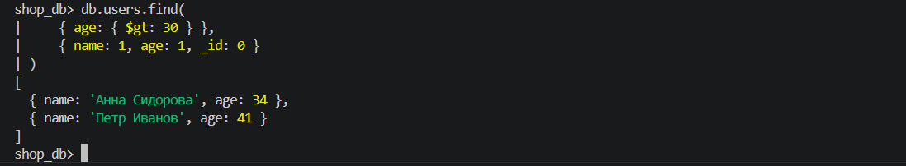
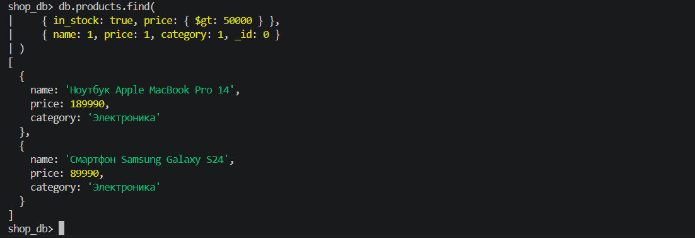

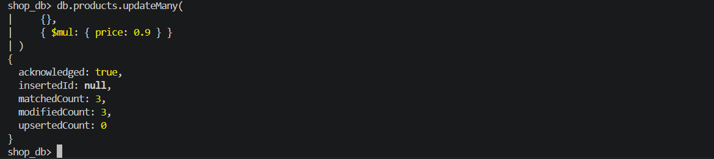
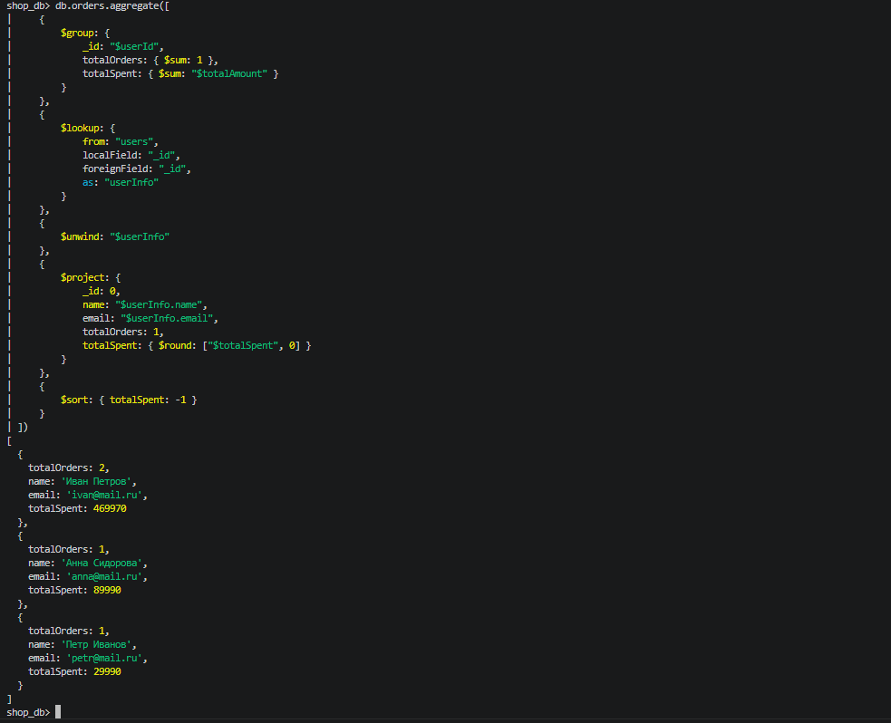

---

ElasticSearch

```yml
services:
  elasticsearch:
    image: elasticsearch:8.11.0
    environment:
      - discovery.type=single-node
      - xpack.security.enabled=false
      - "ES_JAVA_OPTS=-Xms512m -Xmx512m"
    ports:
      - "9200:9200"
      - "9300:9300"
    volumes:
      - es-data:/usr/share/elasticsearch/data
    networks:
      - es-network

  kibana:
    image: kibana:8.11.0
    environment:
      - ELASTICSEARCH_HOSTS=http://elasticsearch:9200
    ports:
      - "5601:5601"
    depends_on:
      - elasticsearch
    networks:
      - es-network

volumes:
  es-data:

networks:
  es-network:
    driver: bridge
```
```powershell
$headers = @{
    "Content-Type" = "application/json"
}

$body = @"
{
  "mappings": {
    "properties": {
      "title": {
        "type": "text",
        "analyzer": "standard"
      },
      "author": {
        "type": "text"
      },
      "price": {
        "type": "float"
      },
      "publish_year": {
        "type": "integer"
      },
      "genre": {
        "type": "keyword"
      },
      "language": {
        "type": "keyword"
      },
      "in_stock": {
        "type": "boolean"
      },
      "rating": {
        "type": "float"
      },
      "pages": {
        "type": "integer"
      },
      "description": {
        "type": "text"
      },
      "tags": {
        "type": "keyword"
      }
    }
  }
}
"@

Invoke-RestMethod -Uri "http://localhost:9200/books" -Method Put -Headers $headers -Body $body
```

```powershell
$headers = @{
    "Content-Type" = "application/json"
}

$bulkBody = @"
{"index": {"_id": "1"}}
{"title": "Война и мир", "author": "Лев Толстой", "price": 899, "publish_year": 1869, "genre": "Роман", "language": "Русский", "in_stock": true, "rating": 4.8, "pages": 1225, "description": "Роман-эпопея о русском обществе в эпоху войн против Наполеона", "tags": ["классика", "исторический", "русская литература"]}
{"index": {"_id": "2"}}
{"title": "Преступление и наказание", "author": "Федор Достоевский", "price": 599, "publish_year": 1866, "genre": "Роман", "language": "Русский", "in_stock": true, "rating": 4.9, "pages": 672, "description": "Психологический роман о студенте Раскольникове", "tags": ["классика", "психология", "детектив"]}
{"index": {"_id": "3"}}
{"title": "Мастер и Маргарита", "author": "Михаил Булгаков", "price": 699, "publish_year": 1967, "genre": "Роман", "language": "Русский", "in_stock": true, "rating": 4.9, "pages": 512, "description": "Мистический роман о дьяволе в Москве", "tags": ["классика", "мистика", "сатира"]}
{"index": {"_id": "4"}}
{"title": "Harry Potter and the Philosophers Stone", "author": "J.K. Rowling", "price": 1299, "publish_year": 1997, "genre": "Фэнтези", "language": "Английский", "in_stock": true, "rating": 4.8, "pages": 332, "description": "First book about young wizard Harry Potter", "tags": ["фэнтези", "приключения", "детская"]}
{"index": {"_id": "5"}}
{"title": "The Hobbit", "author": "J.R.R. Tolkien", "price": 999, "publish_year": 1937, "genre": "Фэнтези", "language": "Английский", "in_stock": false, "rating": 4.7, "pages": 310, "description": "Fantasy novel about Bilbo Baggins adventure", "tags": ["фэнтези", "приключения", "классика"]}
{"index": {"_id": "6"}}
{"title": "1984", "author": "George Orwell", "price": 549, "publish_year": 1949, "genre": "Антиутопия", "language": "Английский", "in_stock": true, "rating": 4.8, "pages": 328, "description": "Dystopian social science fiction novel", "tags": ["антиутопия", "классика", "политика"]}
{"index": {"_id": "7"}}
{"title": "Анна Каренина", "author": "Лев Толстой", "price": 749, "publish_year": 1877, "genre": "Роман", "language": "Русский", "in_stock": true, "rating": 4.7, "pages": 864, "description": "Трагическая история любви замужней дамы", "tags": ["классика", "любовь", "русская литература"]}
{"index": {"_id": "8"}}
{"title": "Идиот", "author": "Федор Достоевский", "price": 649, "publish_year": 1869, "genre": "Роман", "language": "Русский", "in_stock": true, "rating": 4.6, "pages": 640, "description": "Роман о князе Мышкине", "tags": ["классика", "психология", "русская литература"]}
{"index": {"_id": "9"}}
{"title": "The Lord of the Rings", "author": "J.R.R. Tolkien", "price": 1899, "publish_year": 1954, "genre": "Фэнтези", "language": "Английский", "in_stock": true, "rating": 4.9, "pages": 1178, "description": "Epic high-fantasy novel", "tags": ["фэнтези", "эпический", "приключения"]}
{"index": {"_id": "10"}}
{"title": "Собачье сердце", "author": "Михаил Булгаков", "price": 399, "publish_year": 1925, "genre": "Повесть", "language": "Русский", "in_stock": false, "rating": 4.8, "pages": 224, "description": "Сатирическая повесть о научном эксперименте", "tags": ["классика", "сатира", "фантастика"]}
{"index": {"_id": "11"}}
{"title": "The Catcher in the Rye", "author": "J.D. Salinger", "price": 699, "publish_year": 1951, "genre": "Роман", "language": "Английский", "in_stock": true, "rating": 4.3, "pages": 234, "description": "Story about teenage alienation", "tags": ["классика", "психология", "young adult"]}
{"index": {"_id": "12"}}
{"title": "Вино из одуванчиков", "author": "Рэй Брэдбери", "price": 549, "publish_year": 1957, "genre": "Роман", "language": "Русский", "in_stock": true, "rating": 4.6, "pages": 320, "description": "Автобиографическая повесть о лете 1928 года", "tags": ["классика", "лето", "воспоминания"]}

"@

Invoke-RestMethod -Uri "http://localhost:9200/books/_bulk" -Method Post -Headers $headers -Body $bulkBody
```

```powershell
$headers = @{"Content-Type" = "application/json"}

$query1 = @"
{
  "query": {
    "match": {
      "description": "роман"
    }
  }
}
"@

Invoke-RestMethod -Uri "http://localhost:9200/books/_search?pretty" -Method Post -Headers $headers -Body $query1
```
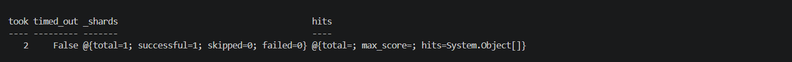

```powershell
$headers = @{"Content-Type" = "application/json"}

$query2 = @"
{
  "query": {
    "term": {
      "language": "Русский"
    }
  }
}
"@

Invoke-RestMethod -Uri "http://localhost:9200/books/_search?pretty" -Method Post -Headers $headers -Body $query2
```


```powershell
$headers = @{"Content-Type" = "application/json"}

$query3 = @"
{
  "query": {
    "range": {
      "price": {
        "gte": 500,
        "lte": 1000
      }
    }
  },
  "sort": [
    { "price": "asc" }
  ]
}
"@

Invoke-RestMethod -Uri "http://localhost:9200/books/_search?pretty" -Method Post -Headers $headers -Body $query3
```


```powershell
$headers = @{"Content-Type" = "application/json"}

$query4 = @"
{
  "query": {
    "bool": {
      "must": [
        {
          "bool": {
            "should": [
              { "match": { "author": "Толстой" } },
              { "match": { "author": "Достоевский" } }
            ],
            "minimum_should_match": 1
          }
        },
        { "term": { "in_stock": true } },
        { "range": { "rating": { "gt": 4.7 } } },
        { "range": { "price": { "lt": 1000 } } }
      ]
    }
  }
}
"@

Invoke-RestMethod -Uri "http://localhost:9200/books/_search?pretty" -Method Post -Headers $headers -Body $query4
```


---

Redis

```yml
services:
  redis:
    image: redis:7-alpine
    container_name: redis-homework
    ports:
      - "6379:6379"
    volumes:
      - redis-data:/data
    command: redis-server --appendonly yes
    networks:
      - redis-network

volumes:
  redis-data:

networks:
  redis-network:
    driver: bridge
```
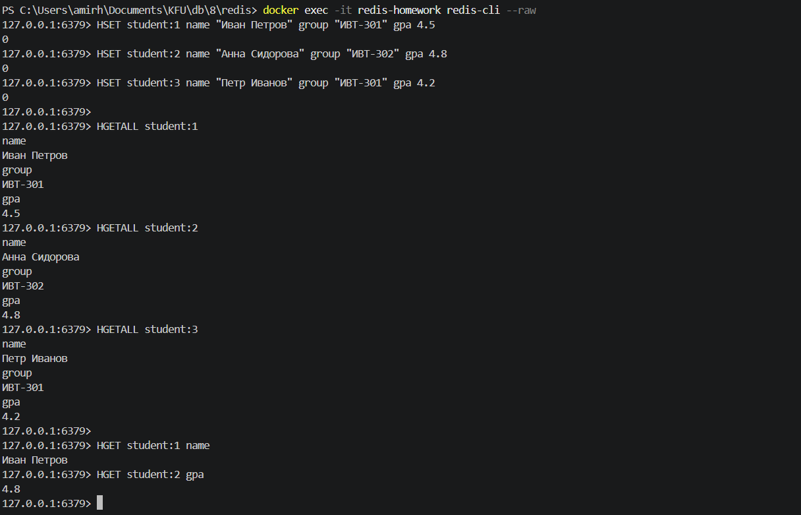

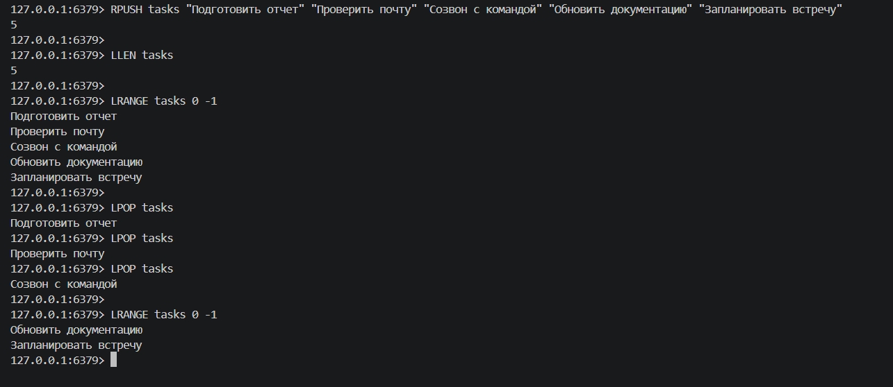
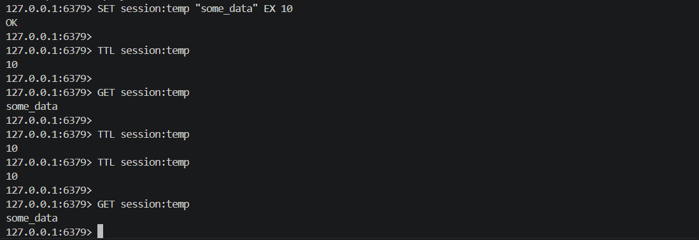
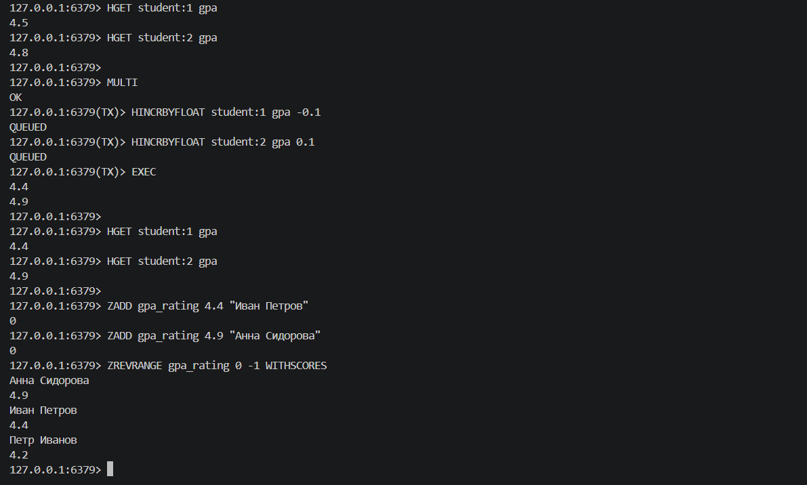

---

Neo4j

```yml
version: '3.8'
services:
  neo4j:
    image: neo4j:5-enterprise
    container_name: neo4j
    ports:
      - "7474:7474"
      - "7687:7687"
    environment:
      - NEO4J_AUTH=neo4j/password123
      - NEO4J_ACCEPT_LICENSE_AGREEMENT=yes
      - NEO4J_PLUGINS='["apoc", "graph-data-science"]'
    volumes:
      - ./neo4j/data:/data
      - ./neo4j/logs:/logs
      - ./neo4j/import:/var/lib/neo4j/import
    networks:
      - neo4j-network

networks:
  neo4j-network:
    driver: bridge
```
```cypher
CREATE (alex:User {name: "Alex"}),
       (maria:User {name: "Maria"}),
       (john:User {name: "John"})
RETURN *
CREATE (inception:Movie {title: "Inception"}),
       (matrix:Movie {title: "The Matrix"}),
       (titanic:Movie {title: "Titanic"}),
       (avatar:Movie {title: "Avatar"})
RETURN *
MATCH (a:User {name: "Alex"}), (m:User {name: "Maria"})
CREATE (a)-[:FRIENDS]->(m)

MATCH (m:User {name: "Maria"}), (j:User {name: "John"})
CREATE (m)-[:FRIENDS]->(j)

MATCH (a:User {name: "Alex"}), (j:User {name: "John"})
CREATE (a)-[:FRIENDS]->(j)

RETURN *
MATCH (a:User {name: "Alex"}), (i:Movie {title: "Inception"})
CREATE (a)-[:WATCHED {rating: 5}]->(i)

MATCH (m:User {name: "Maria"}), (i:Movie {title: "Inception"})
CREATE (m)-[:WATCHED {rating: 4}]->(i)

MATCH (m:User {name: "Maria"}), (mx:Movie {title: "The Matrix"})
CREATE (m)-[:WATCHED {rating: 5}]->(mx)

MATCH (j:User {name: "John"}), (t:Movie {title: "Titanic"})
CREATE (j)-[:WATCHED {rating: 3}]->(t)

MATCH (j:User {name: "John"}), (mx:Movie {title: "The Matrix"})
CREATE (j)-[:WATCHED {rating: 4}]->(mx)

RETURN *
```
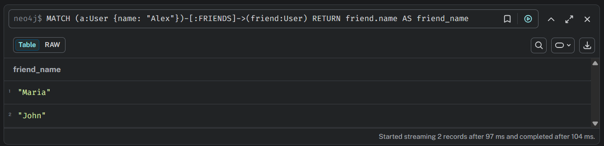
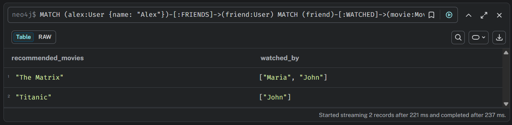
В PostgreSQL:
```sql
CREATE TABLE users (
    id INT PRIMARY KEY,
    name VARCHAR(50)
);

CREATE TABLE movies (
    id INT PRIMARY KEY,
    title VARCHAR(100)
);

CREATE TABLE friends (
    user_id INT,
    friend_id INT,
    FOREIGN KEY (user_id) REFERENCES users(id),
    FOREIGN KEY (friend_id) REFERENCES users(id)
);

CREATE TABLE watched (
    user_id INT,
    movie_id INT,
    rating INT,
    FOREIGN KEY (user_id) REFERENCES users(id),
    FOREIGN KEY (movie_id) REFERENCES movies(id)
);

INSERT INTO users VALUES (1, 'Alex'), (2, 'Maria'), (3, 'John');
INSERT INTO movies VALUES (1, 'Inception'), (2, 'The Matrix'), (3, 'Titanic'), (4, 'Avatar');
INSERT INTO friends VALUES (1, 2), (2, 3), (1, 3);
INSERT INTO watched VALUES (1, 1, 5), (2, 1, 4), (2, 2, 5), (3, 3, 3), (3, 2, 4);

SELECT u.name AS friend_name
FROM users u
JOIN friends f ON u.id = f.friend_id
JOIN users a ON f.user_id = a.id
WHERE a.name = 'Alex';

SELECT DISTINCT m.title AS movie_title, u.name AS recommended_by
FROM users a
JOIN friends f ON a.id = f.user_id
JOIN users u ON f.friend_id = u.id
JOIN watched w ON u.id = w.user_id
JOIN movies m ON w.movie_id = m.id
WHERE a.name = 'Alex'
  AND m.id NOT IN (
    SELECT movie_id 
    FROM watched 
    WHERE user_id = a.id
  );
```
---

Clickhouse

```yml
services:
  clickhouse:
    image: clickhouse/clickhouse-server:latest
    container_name: clickhouse-lab
    ports:
      - '8123:8123'
      - '9000:9000'
    environment:
      CLICKHOUSE_DB: default
      CLICKHOUSE_USER: default
      CLICKHOUSE_PASSWORD: password
    volumes:
      - clickhouse_data:/var/lib/clickhouse
    ulimits:
      nofile:
        soft: 262144
        hard: 262144

  postgres:
    image: postgres:16
    container_name: postgres-lab
    ports:
      - '5432:5432'
    environment:
      POSTGRES_DB: postgres
      POSTGRES_USER: postgres
      POSTGRES_PASSWORD: postgres
    volumes:
      - postgres_data:/var/lib/postgresql/data

volumes:
  clickhouse_data:
  postgres_data:

```
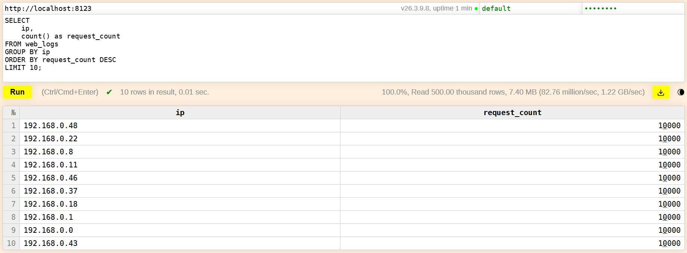
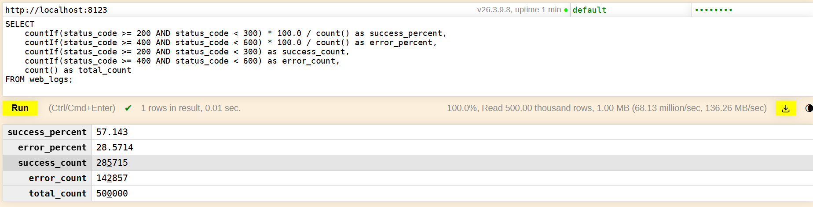
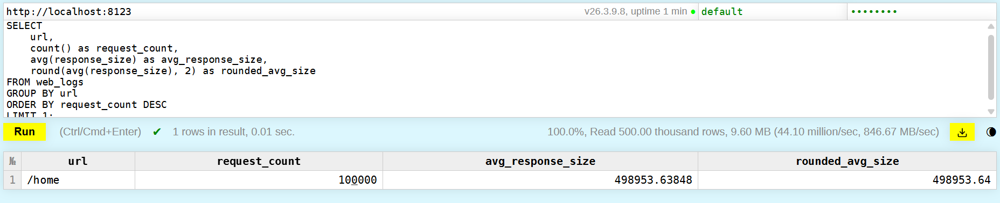
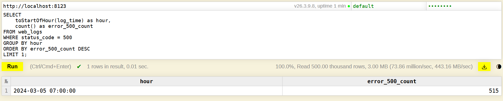
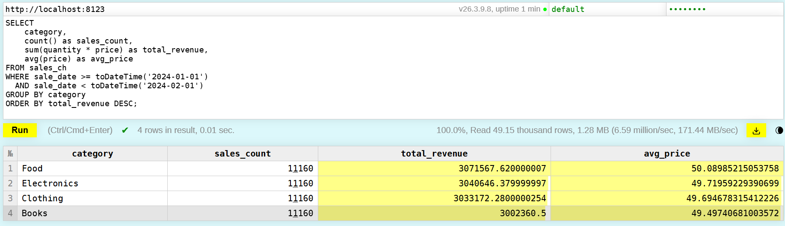
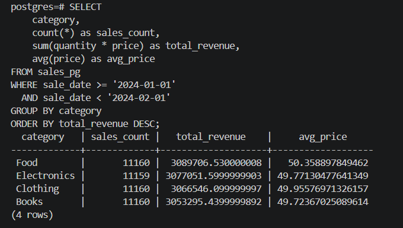
1) Clickhouse быстрее вставил данные (~1сек)
   PostgreSQL ~10сек
2) ClickHouse обычно сжимает данные в 5-10 раз эффективнее PostgreSQL
3, 4) ClickHouse лучше для:
      Аналитических запросов с агрегацией больших объемов данных
      Систем реального времени и логов
      Когда важна скорость выполнения OLAP-запросов
      При ограниченном дисковом пространстве (лучшее сжатие)

PostgreSQL лучше для:
      Транзакционных систем (OLTP)
      Когда нужны частые обновления и удаления записей
      Сложных JOIN-запросов с гарантированной целостностью
      Приложений с ACID-транзакциями
