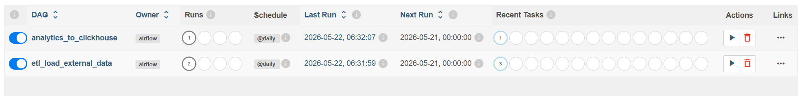
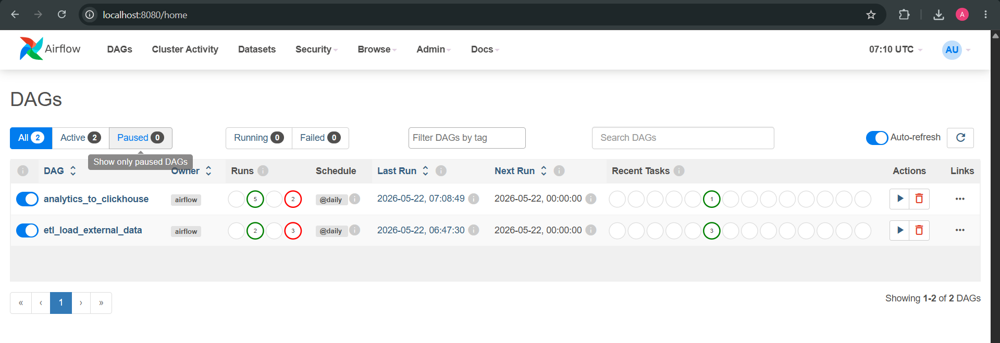
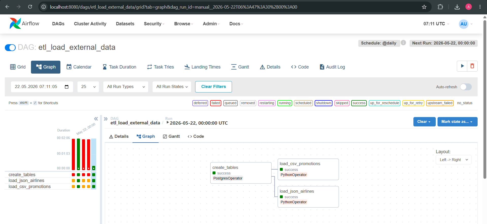
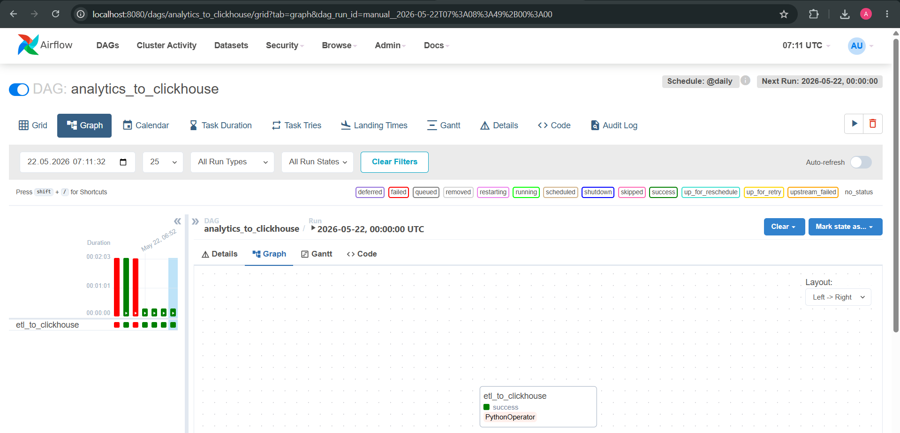
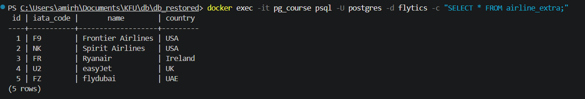
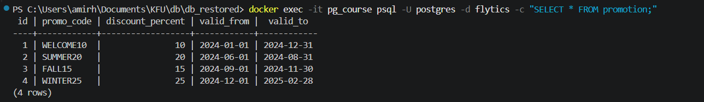
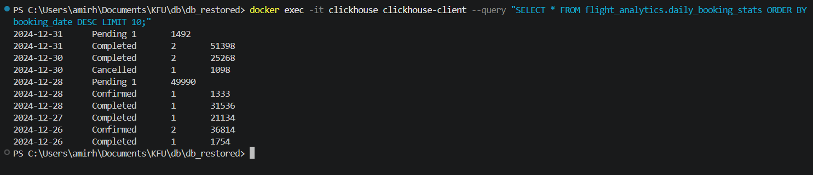

1. Источники данных
   
  -JSON-файл содержал дополнительные авиакомпании. У каждой компании указан IATA-код, название и страна.
  
  -CSV-файл содержал промокоды и акции. В нём семь записей с разными скидками, с указанием сроков действия.

  ```json
    [
      {"iata_code": "F9", "name": "Frontier Airlines", "country": "USA"},
      {"iata_code": "NK", "name": "Spirit Airlines", "country": "USA"},
      {"iata_code": "FR", "name": "Ryanair", "country": "Ireland"},
      {"iata_code": "U2", "name": "easyJet", "country": "UK"},
      {"iata_code": "FZ", "name": "flydubai", "country": "UAE"}
    ]
  ```

  ```csv
    promo_code,discount_percent,valid_from,valid_to
    WELCOME10,10,2024-01-01,2024-12-31
    SUMMER20,20,2024-06-01,2024-08-31
    FALL15,15,2024-09-01,2024-11-30
    WINTER25,25,2024-12-01,2025-02-28
  ```

2. Какие таблицы пополняются

   airline_extra — хранит авиакомпании из JSON-файла. Структура: id, iata_code, name, country.

   promotion — хранит промокоды из CSV-файла. Структура: id, promo_code, discount_percent, valid_from, valid_to.

3. Как устроен DAG 1

   Задачи внутри DAG:

      create_tables — проверяет, существуют ли таблицы airline_extra и promotion, и создаёт их при необходимости.

      load_json_airlines — читает файл airlines_extra.json из папки sources/, преобразует в SQL-запросы и вставляет данные. Используется конструкция ON CONFLICT DO NOTHING, чтобы при повторном запуске не дублировались записи.

      load_csv_promotions — аналогично читает CSV-файл, парсит его через pandas и загружает в таблицу promotion.

4. Как устроен DAG 2

    Только одна задача — etl_to_clickhouse, которая делает всё:
    
      Подключается к PostgreSQL через Hook.
      
      Выполняет SELECT-запрос к таблице booking, объединяя её со справочником booking_status.
      
      Подключается к ClickHouse через HTTP API.
      
      Создаёт базу данных flight_analytics.
      
      Создаёт таблицу fact_bookings.
      
      Создаёт материализованное представление daily_booking_stats, которое автоматически агрегирует данные по датам и статусам.
      
      Очищает старые данные.
      
      Вставляет новые данные из PostgreSQL в ClickHouse.
      
      Выводит результат в лог для проверки.

5. Таблицы в ClickHouse

   fact_bookings — основная таблица с фактами бронирований
   daily_booking_stats — материализованное представление-витрина. Содержит агрегированные данные: дата, статус, количество бронирований, общая выручка.

6. Аналитическая витрина

   В ClickHouse построена витрина daily_booking_stats. Она показывает:

      По какому статусу сколько бронирований в день.
      Сколько денег принесло каждое направление

7. Метрики

   Количество бронирований в день по статусам.

    Общая выручка — сумма total_cost по подтверждённым и оплаченным бронированиям.
    
    Процент отмен.
    
    Динамика за последние дни по полю booking_date.

8. Обеспечение идентичности данных

     В DAG 1 используется ON CONFLICT DO NOTHING. Если запись с таким iata_code уже есть, она игнорируется.

    В DAG 2 перед вставкой выполняется ALTER TABLE ... DELETE WHERE 1=1 — это очищает всю таблицу перед новой загрузкой. Потом вставляются свежие данные.

9. Проверки качества данных

    В DAG 1:
  
      Перед загрузкой проверяется, что файлы JSON и CSV существуют.
      
      При ошибке подключения к PostgreSQL задача падает и пробует снова через 2 минуты.
      
      Таблицы создаются через CREATE TABLE IF NOT EXISTS.
  
    В DAG 2:
    
      Проверка, что данные из PostgreSQL извлечены.
      
      При ошибке подключения к ClickHouse DAG падает.
      
      Вставка каждой строки проверяется по HTTP-статусу.
      
      Результат витрины выводится в лог.

   10. Как запустить проект
  
        Скопировать файлы проекта в папку.

        Наличие файлов:
        
          docker-compose-airflow.yml
          
          init/flytics.sql — схема базы данных
          
          dags/01_etl_dag.py и dags/02_analytics_dag.py
          
          sources/airlines_extra.json и sources/promotions.csv
          
          Python-скрипты db_fill-*.py для наполнения БД
        
        Запустить контейнеры командой:
          docker-compose -f docker-compose-airflow.yml up -d
       
        Подождать минуту, пока всё поднимется.
        
        Заполнить PostgreSQL тестовыми данными (запустить Python-скрипты по порядку).
        
        Открыть браузер, перейти на http://localhost:8080, войти с логином admin и паролем admin.
        
        В разделе Connections добавить подключение к PostgreSQL:
        
          Connection Id: postgres_default
          
          Host: postgres
          
          База: flytics
          
          Логин: postgres
          
          Пароль: 7777
        
        Включить оба DAG.
        
        Запустить DAG 1.
        
        Через минуту запустить DAG 2.
        
        Проверить результаты:
        
        В PostgreSQL: SELECT * FROM airline_extra;
        
        В ClickHouse: SELECT * FROM flight_analytics.daily_booking_stats;

       
