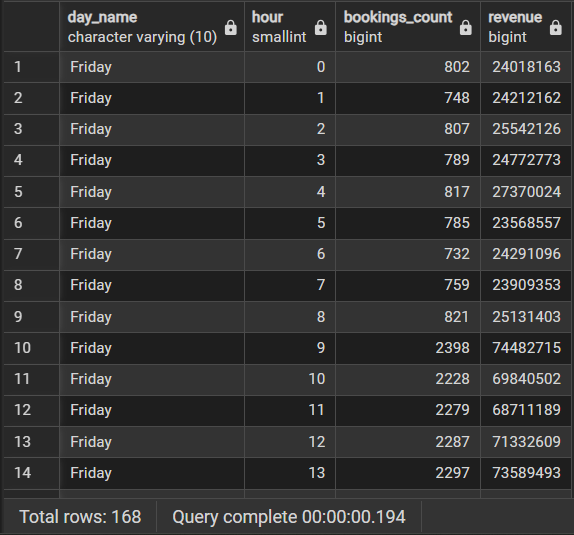
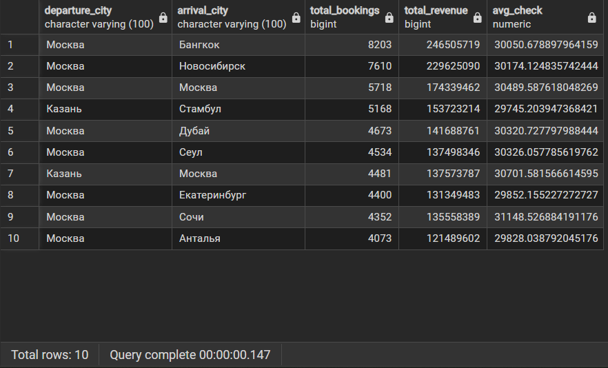
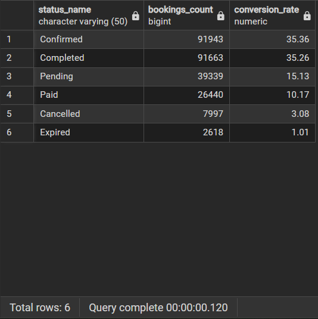

1)
-Какая динамика бронирований по дням? (анализ сезонности, дней недели)
-Какие направления самые популярные?
-Какая конверсия из статуса Pending → Confirmed → Paid → Completed?

2) Факт: fact_booking

3) Зерно: одна строка = одно бронирование

4)
dim_date — дата бронирования

dim_client — клиент 

dim_route — маршрут

dim_booking_status — статус брони

5)
```sql
CREATE SCHEMA IF NOT EXISTS olap;

CREATE TABLE olap.dim_date (
    date_id INTEGER PRIMARY KEY,
    full_date DATE NOT NULL,
    year SMALLINT,
    quarter SMALLINT,
    month SMALLINT,
    month_name VARCHAR(20),
    week SMALLINT,
    day_of_week SMALLINT,
    day_name VARCHAR(10),
    hour SMALLINT,
    is_weekend BOOLEAN
);

CREATE TABLE olap.dim_client (
    client_id INTEGER PRIMARY KEY,
    first_name VARCHAR(100),
    last_name VARCHAR(100),
    email VARCHAR(100),
    loyalty_level VARCHAR(20)
);

CREATE TABLE olap.dim_route (
    route_id SERIAL PRIMARY KEY,
    departure_city VARCHAR(100),
    arrival_city VARCHAR(100),
    airline_code VARCHAR(3),
    airline_name VARCHAR(100)
);

CREATE TABLE olap.dim_booking_status (
    status_id INTEGER PRIMARY KEY,
    status_name VARCHAR(50)
);

CREATE TABLE olap.fact_booking (
    booking_id INTEGER PRIMARY KEY,
    date_id INTEGER NOT NULL,
    client_id INTEGER NOT NULL,
    route_id INTEGER NOT NULL,
    status_id INTEGER NOT NULL,
    total_cost INTEGER,
    num_tickets INTEGER,
    num_passengers INTEGER,
    is_paid BOOLEAN,
    days_to_payment INTEGER,
    FOREIGN KEY (date_id) REFERENCES olap.dim_date(date_id),
    FOREIGN KEY (client_id) REFERENCES olap.dim_client(client_id),
    FOREIGN KEY (route_id) REFERENCES olap.dim_route(route_id),
    FOREIGN KEY (status_id) REFERENCES olap.dim_booking_status(status_id)
);
```

Заполняем данными:
```sql
ALTER TABLE olap.fact_booking ALTER COLUMN route_id DROP NOT NULL;

TRUNCATE TABLE olap.fact_booking;

INSERT INTO olap.fact_booking (
    booking_id, date_id, client_id, route_id, status_id,
    total_cost, num_tickets, num_passengers, is_paid, days_to_payment
)
SELECT 
    b.id,
    EXTRACT(YEAR FROM b.booking_date) * 1000000 +
    EXTRACT(MONTH FROM b.booking_date) * 10000 +
    EXTRACT(DAY FROM b.booking_date) * 100 +
    EXTRACT(HOUR FROM b.booking_date) AS date_id,
    b.client_id,
    MIN(r.route_id) AS route_id,
    b.status_id,
    b.total_cost,
    COUNT(DISTINCT t.id) AS num_tickets,
    COUNT(DISTINCT t.passenger_id) AS num_passengers,
    BOOL_OR(p.id IS NOT NULL) AS is_paid,
    MIN(EXTRACT(DAY FROM (p.payment_date - b.booking_date))) AS days_to_payment
FROM booking b
LEFT JOIN ticket t ON t.booking_id = b.id
LEFT JOIN flight f ON f.id = t.flight_id
LEFT JOIN flight_number fn ON fn.number = f.flight_number
LEFT JOIN airport a_dep ON a_dep.iata_code = fn.departure_airport_id
LEFT JOIN city c_dep ON c_dep.id = a_dep.city_id
LEFT JOIN airport a_arr ON a_arr.iata_code = fn.arrival_airport_id
LEFT JOIN city c_arr ON c_arr.id = a_arr.city_id
LEFT JOIN olap.dim_route r ON r.departure_city = c_dep.name AND r.arrival_city = c_arr.name
LEFT JOIN payment p ON p.booking_id = b.id
GROUP BY b.id, b.booking_date, b.client_id, b.status_id, b.total_cost;
```

Запросы: 

1) Динамика бронирований по дням недели и часам
```sql
SELECT 
    d.day_name,
    d.hour,
    COUNT(*) AS bookings_count,
    SUM(f.total_cost) AS revenue
FROM olap.fact_booking f
JOIN olap.dim_date d ON f.date_id = d.date_id
GROUP BY d.day_name, d.hour
ORDER BY d.day_name, d.hour;
```


2) Самые популярные направления
```sql
SELECT 
    r.departure_city,
    r.arrival_city,
    COUNT(*) AS total_bookings,
    SUM(f.total_cost) AS total_revenue,
    AVG(f.total_cost) AS avg_check
FROM olap.fact_booking f
JOIN olap.dim_route r ON f.route_id = r.route_id
GROUP BY r.departure_city, r.arrival_city
ORDER BY total_bookings DESC
LIMIT 10;
```


3) Конверсия по статусам бронирования
```sql
SELECT 
    s.status_name,
    COUNT(*) AS bookings_count,
    ROUND(100.0 * COUNT(*) / SUM(COUNT(*)) OVER(), 2) AS conversion_rate
FROM olap.fact_booking f
JOIN olap.dim_booking_status s ON f.status_id = s.status_id
GROUP BY s.status_name
ORDER BY conversion_rate DESC;
```

