1. Создание таблицы tasks
```sql
CREATE TABLE IF NOT EXISTS tasks (
    id SERIAL PRIMARY KEY,
    payload JSONB NOT NULL DEFAULT '{}',
    status VARCHAR(20) NOT NULL DEFAULT 'ready',
    priority INT NOT NULL DEFAULT 0,
    scheduled_at TIMESTAMPTZ NOT NULL DEFAULT now(),
    created_at TIMESTAMPTZ NOT NULL DEFAULT now(),
    started_at TIMESTAMPTZ,
    completed_at TIMESTAMPTZ,
    worker_id VARCHAR(50),
    attempts INT NOT NULL DEFAULT 0,
    max_attempts INT NOT NULL DEFAULT 5,
    error_message TEXT,
    entity_type VARCHAR(50),
    entity_id INT
);

CREATE INDEX IF NOT EXISTS idx_tasks_status_scheduled
    ON tasks (status, scheduled_at, priority DESC)
    WHERE status IN ('ready', 'retry');

CREATE INDEX IF NOT EXISTS idx_tasks_stuck
    ON tasks (status, started_at)
    WHERE status = 'running';

CREATE INDEX IF NOT EXISTS idx_tasks_entity
    ON tasks (entity_type, entity_id)
    WHERE status IN ('ready', 'running', 'retry');

ALTER TABLE tasks SET (
    autovacuum_vacuum_scale_factor = 0.01,
    autovacuum_vacuum_threshold = 1000,
    autovacuum_analyze_scale_factor = 0.005,
    autovacuum_analyze_threshold = 500
);
```

---

Producer:
```java
import java.sql.*;
import java.time.LocalDateTime;
import java.util.Random;
import java.util.concurrent.TimeUnit;
import java.util.concurrent.atomic.AtomicInteger;

public class Producer {
    private static final String[] TASK_TYPES = {
            "send_booking_confirmation", "generate_ticket", "process_payment",
            "send_flight_reminder", "update_loyalty_status", "generate_report",
            "check_in_passenger", "cancel_booking", "refund_payment", "send_promotion"
    };

    private final Random rand = new Random();
    private final int ratePerSecond;
    private final Integer durationSeconds;
    private volatile boolean running = true;
    private final AtomicInteger taskCount = new AtomicInteger(0);

    public Producer(int ratePerSecond, Integer durationSeconds) {
        this.ratePerSecond = ratePerSecond;
        this.durationSeconds = durationSeconds;
    }

    private String generatePayload(String taskType) {
        return switch (taskType) {
            case "send_booking_confirmation" -> String.format(
                    "{\"booking_id\":%d,\"email\":\"client%d@example.com\"}",
                    rand.nextInt(260_000) + 1, rand.nextInt(100_000) + 1);
            case "generate_ticket" -> String.format(
                    "{\"booking_id\":%d,\"passenger_id\":%d,\"seat\":\"%d%s\"}",
                    rand.nextInt(260_000) + 1, rand.nextInt(200_000) + 1,
                    rand.nextInt(40) + 1, new char[]{'A', 'B', 'C', 'D', 'E', 'F'}[rand.nextInt(6)]);
            case "process_payment" -> String.format(
                    "{\"booking_id\":%d,\"amount\":%d,\"method\":\"%s\"}",
                    rand.nextInt(260_000) + 1,
                    (rand.nextInt(148) + 3) * 1000,
                    new String[]{"card", "paypal", "bank_transfer"}[rand.nextInt(3)]);
            default -> String.format("{\"data\":\"sample_%d\"}", rand.nextInt(10000) + 1);
        };
    }

    public void start() throws SQLException {
        long startTime = System.currentTimeMillis();

        System.out.printf("Producer started. Rate: %d/sec, Duration: %s sec%n",
                ratePerSecond, durationSeconds == null ? "unlimited" : durationSeconds);

        Runtime.getRuntime().addShutdownHook(new Thread(() -> {
            running = false;
            System.out.printf("%nProducer stopped by Ctrl+C. Total tasks: %d%n", taskCount.get());
        }));

        while (running) {
            if (durationSeconds != null &&
                    (System.currentTimeMillis() - startTime) > durationSeconds * 1000L) {
                running = false;
                break;
            }

            long batchStart = System.nanoTime();
            int batchTasks = 0;

            while (batchTasks < ratePerSecond && running) {
                try (Connection conn = DbConfig.getConnection()) {
                    conn.setAutoCommit(false);

                    boolean isCritical = rand.nextDouble() < 0.2;
                    int priority = isCritical ? 10 : 0;
                    String taskType = TASK_TYPES[rand.nextInt(TASK_TYPES.length)];
                    String payload = generatePayload(taskType);
                    int entityId = rand.nextInt(260_000) + 1;

                    try (PreparedStatement check = conn.prepareStatement(
                            "SELECT 1 FROM client WHERE id = ?")) {
                        check.setInt(1, rand.nextInt(100_000) + 1);
                        check.executeQuery();
                    }

                    try (PreparedStatement insert = conn.prepareStatement(
                            "INSERT INTO tasks (payload, status, priority, scheduled_at, entity_type, entity_id) " +
                                    "VALUES (?::jsonb, 'ready', ?, ?, ?, ?)")) {
                        insert.setString(1, payload);
                        insert.setInt(2, priority);
                        insert.setObject(3, LocalDateTime.now());
                        insert.setString(4, taskType);
                        insert.setInt(5, entityId);
                        insert.executeUpdate();
                    }

                    conn.commit();
                    batchTasks++;
                    taskCount.incrementAndGet();
                } catch (SQLException e) {
                    System.err.println("Insert error: " + e.getMessage());
                }
            }

            int count = taskCount.get();
            if (count % 100 == 0 && count > 0) {
                System.out.printf("Produced %d tasks%n", count);
            }

            try (Connection conn = DbConfig.getConnection();
                 Statement stmt = conn.createStatement()) {
                stmt.execute("NOTIFY new_task, 'batch_ready'");
            } catch (SQLException e) {
            }

            long elapsedNanos = System.nanoTime() - batchStart;
            long sleepNanos = 1_000_000_000L - elapsedNanos;
            if (sleepNanos > 0) {
                try {
                    TimeUnit.NANOSECONDS.sleep(sleepNanos);
                } catch (InterruptedException e) {
                    Thread.currentThread().interrupt();
                    running = false;
                    break;
                }
            }
        }

        System.out.printf("Producer finished. Total tasks: %d%n", taskCount.get());
    }

    public static void main(String[] args) throws SQLException {
        int rate = 100;
        Integer duration = null;

        for (int i = 0; i < args.length; i++) {
            if ("--rate".equals(args[i]) && i + 1 < args.length) {
                rate = Integer.parseInt(args[++i]);
            } else if ("--duration".equals(args[i]) && i + 1 < args.length) {
                duration = Integer.parseInt(args[++i]);
            }
        }

        new Producer(rate, duration).start();
    }
}
```

---

Consumer:
```java
import java.sql.*;
import java.time.LocalDateTime;
import java.util.Random;
import java.util.concurrent.TimeUnit;
import java.util.concurrent.atomic.AtomicLong;

public class Consumer {
    private final String workerId;
    private final Random rand = new Random();
    private volatile boolean running = true;
    private final AtomicLong processed = new AtomicLong(0);
    private final AtomicLong failed = new AtomicLong(0);

    public Consumer(String workerId) {
        this.workerId = workerId != null ? workerId :
                "worker_" + ProcessHandle.current().pid() + "_" + new Random().nextInt(10000);
    }

    private void processTask(long taskId, String taskType) throws Exception {
        long processingTime = 50 + rand.nextInt(451);
        TimeUnit.MILLISECONDS.sleep(processingTime);
        if (rand.nextDouble() < 0.05) {
            throw new RuntimeException("Simulated error processing " + taskType);
        }
    }

    public void start() throws SQLException {
        System.out.printf("Consumer %s started%n", workerId);

        Runtime.getRuntime().addShutdownHook(new Thread(() -> {
            running = false;
            System.out.printf("%n[%s] Stopped. Processed: %d, Failed: %d%n",
                    workerId, processed.get(), failed.get());
        }));

        Thread cleanupThread = new Thread(this::stuckTaskCleanup, "cleanup-" + workerId);
        cleanupThread.setDaemon(true);
        cleanupThread.start();

        while (running) {
            processNextTask();
        }
    }

    private void processNextTask() {
        try (Connection conn = DbConfig.getConnection()) {
            conn.setAutoCommit(false);

            try (PreparedStatement select = conn.prepareStatement(
                    "SELECT id, priority, entity_type, attempts, max_attempts " +
                            "FROM tasks " +
                            "WHERE status = 'ready' AND scheduled_at <= now() " +
                            "ORDER BY priority DESC, scheduled_at " +
                            "FOR UPDATE SKIP LOCKED " +
                            "LIMIT 1")) {

                ResultSet rs = select.executeQuery();
                if (!rs.next()) {
                    conn.rollback();
                    try { TimeUnit.MILLISECONDS.sleep(100); }
                    catch (InterruptedException e) { Thread.currentThread().interrupt(); }
                    return;
                }

                long taskId = rs.getLong("id");
                String taskType = rs.getString("entity_type");
                int attempts = rs.getInt("attempts");
                int maxAttempts = rs.getInt("max_attempts");

                try (PreparedStatement update = conn.prepareStatement(
                        "UPDATE tasks SET status = 'running', started_at = ?, worker_id = ? WHERE id = ?")) {
                    update.setObject(1, LocalDateTime.now());
                    update.setString(2, workerId);
                    update.setLong(3, taskId);
                    update.executeUpdate();
                }
                conn.commit();

                try {
                    processTask(taskId, taskType);
                    markCompleted(taskId);
                    processed.incrementAndGet();
                } catch (Exception e) {
                    handleError(taskId, attempts + 1, maxAttempts, e.getMessage());
                    failed.incrementAndGet();
                }
            } catch (SQLException e) {
                conn.rollback();
                throw e;
            }
        } catch (SQLException e) {
            System.err.printf("[%s] DB error: %s%n", workerId, e.getMessage());
            try { TimeUnit.MILLISECONDS.sleep(100); }
            catch (InterruptedException ie) { Thread.currentThread().interrupt(); }
        }

        long total = processed.get() + failed.get();
        if (total % 50 == 0 && total > 0) {
            System.out.printf("[%s] Processed: %d, Failed: %d%n",
                    workerId, processed.get(), failed.get());
        }
    }

    private void markCompleted(long taskId) throws SQLException {
        try (Connection conn = DbConfig.getConnection();
             PreparedStatement ps = conn.prepareStatement(
                     "UPDATE tasks SET status = 'completed', completed_at = ? WHERE id = ?")) {
            ps.setObject(1, LocalDateTime.now());
            ps.setLong(2, taskId);
            ps.executeUpdate();
        }
    }

    private void handleError(long taskId, int attempts, int maxAttempts, String errorMsg) throws SQLException {
        try (Connection conn = DbConfig.getConnection()) {
            if (attempts >= maxAttempts) {
                try (PreparedStatement ps = conn.prepareStatement(
                        "UPDATE tasks SET status = 'failed', attempts = ?, error_message = ?, completed_at = ? WHERE id = ?")) {
                    ps.setInt(1, attempts);
                    ps.setString(2, errorMsg.substring(0, Math.min(errorMsg.length(), 500)));
                    ps.setObject(3, LocalDateTime.now());
                    ps.setLong(4, taskId);
                    ps.executeUpdate();
                }
            } else {
                long delaySeconds = (long) Math.pow(2, attempts);
                try (PreparedStatement ps = conn.prepareStatement(
                        "UPDATE tasks SET status = 'retry', attempts = ?, scheduled_at = ?, error_message = ? WHERE id = ?")) {
                    ps.setInt(1, attempts);
                    ps.setObject(2, LocalDateTime.now().plusSeconds(delaySeconds));
                    ps.setString(3, errorMsg.substring(0, Math.min(errorMsg.length(), 500)));
                    ps.setLong(4, taskId);
                    ps.executeUpdate();
                }
            }
        }
    }

    private void stuckTaskCleanup() {
        while (running) {
            try (Connection conn = DbConfig.getConnection();
                 PreparedStatement ps = conn.prepareStatement(
                         "UPDATE tasks SET status = 'ready', started_at = NULL, worker_id = NULL, attempts = attempts + 1 " +
                                 "WHERE status = 'running' AND started_at < ?")) {
                ps.setObject(1, LocalDateTime.now().minusMinutes(5));
                int reset = ps.executeUpdate();
                if (reset > 0) {
                    System.out.printf("[cleanup-%s] Reset %d stuck tasks%n", workerId, reset);
                }
            } catch (SQLException e) {
                System.err.printf("[cleanup] Error: %s%n", e.getMessage());
            }
            try { TimeUnit.SECONDS.sleep(30); }
            catch (InterruptedException e) { Thread.currentThread().interrupt(); break; }
        }
    }

    public static void main(String[] args) throws SQLException {
        String workerId = null;
        for (int i = 0; i < args.length; i++) {
            if ("--worker-id".equals(args[i]) && i + 1 < args.length) {
                workerId = args[++i];
            }
        }
        new Consumer(workerId).start();
    }
}
```

---

Запуск Consumer 1, Consumer 2, затем Producer.

## Producer
- Генерирует 200 задач/сек
- 80% обычных (priority=0), 20% критических (priority=10)
- Вставка задачи в одной транзакции с проверкой client
- Шлёт NOTIFY new_task для пробуждения консьюмеров

## Consumer (2 воркера)
- Конкурируют за задачи через SELECT ... FOR UPDATE SKIP LOCKED
- Имитация обработки: 50-500ms sleep, 5% ошибок
- Retry с exponential backoff: 2^attempts секунд
- После max_attempts (5) задача уходит в failed (DLQ)
- Фоновый поток раз в 30 сек чистит зависшие задачи (>5 мин в running)
---

Текущее состояние очереди
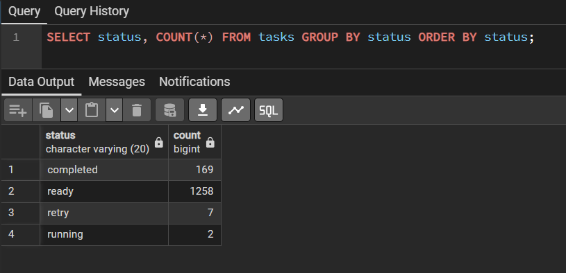

---

Лаг очереди (самая старая задача в ready)
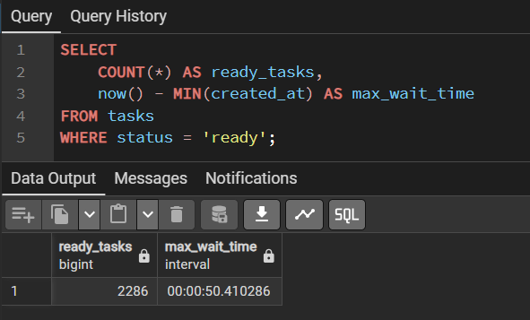

---

Пропускная способность (completed за последнюю минуту)
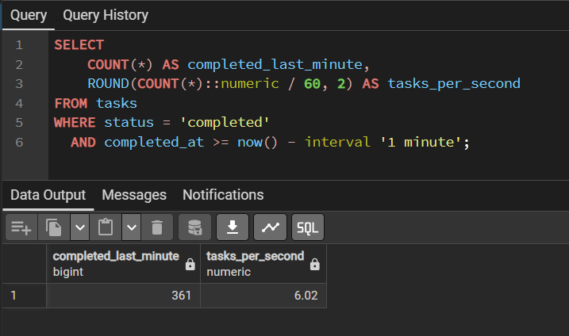

---

Распределение по приоритетам (~80% priority=0, ~20% priority=10)
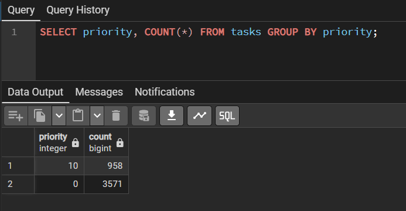

---

Задачи с retry
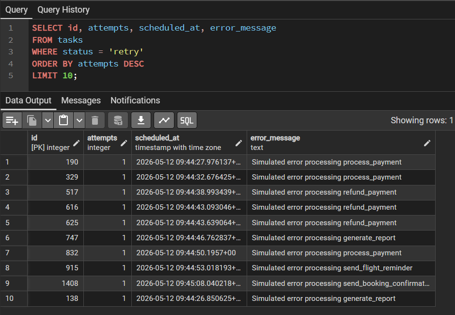

---

Задачи в DLQ (failed)
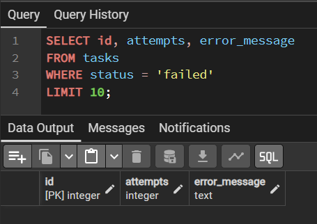

---

Размер таблицы и bloat (до VACUUM)
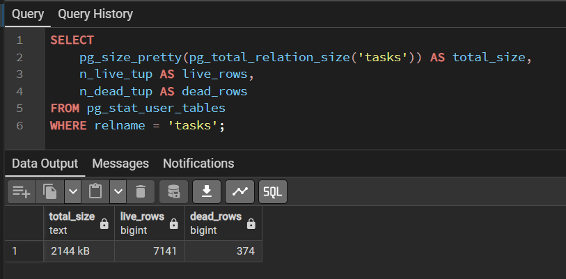

VACUUM
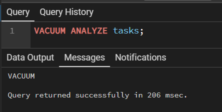

После VACUUM
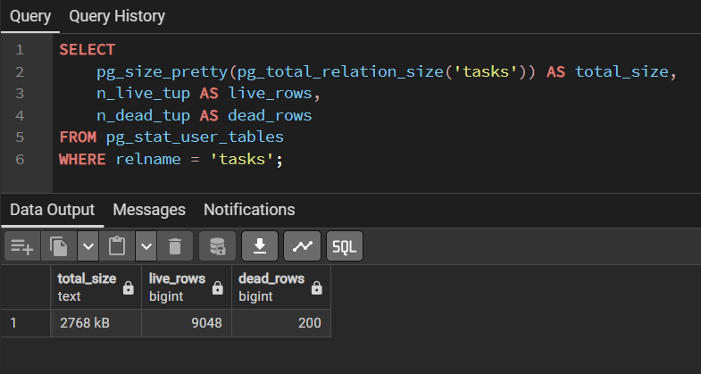

---

Финальное состояние
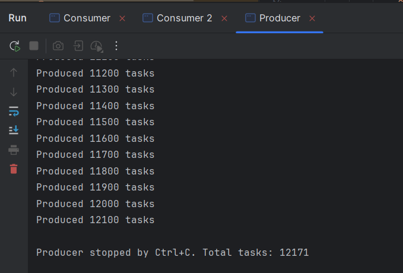
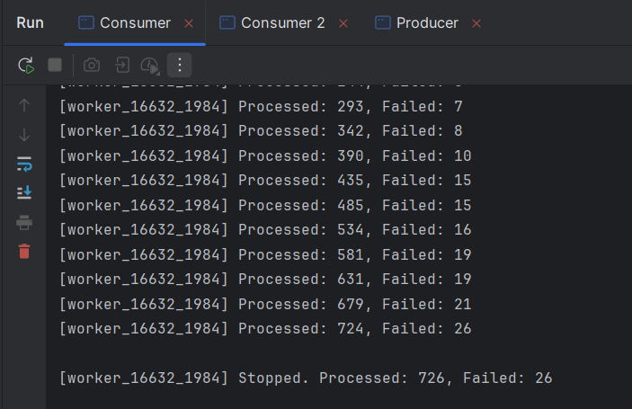
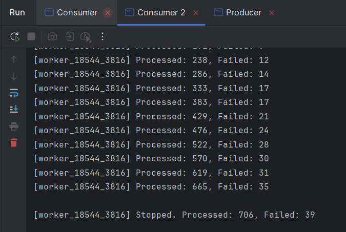
