#Секционирование
##Range
```sql
CREATE TABLE booking_partitioned (
    id integer NOT NULL,
    client_id integer NOT NULL,
    booking_date timestamp with time zone NOT NULL,
    total_cost integer NOT NULL,
    status_id integer NOT NULL,
    notes text,
    baggage_info jsonb
) PARTITION BY RANGE (booking_date);

CREATE TABLE booking_2024_01 PARTITION OF booking_partitioned
    FOR VALUES FROM ('2024-01-01') TO ('2024-06-01');

CREATE TABLE booking_2024_02 PARTITION OF booking_partitioned
    FOR VALUES FROM ('2024-06-01') TO ('2024-12-31');

CREATE TABLE booking_other PARTITION OF booking_partitioned DEFAULT;

INSERT INTO booking_partitioned
SELECT * FROM booking;
```
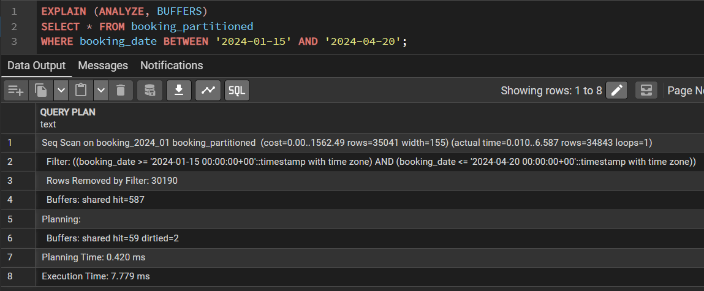
В запросе участвует 1 партиция
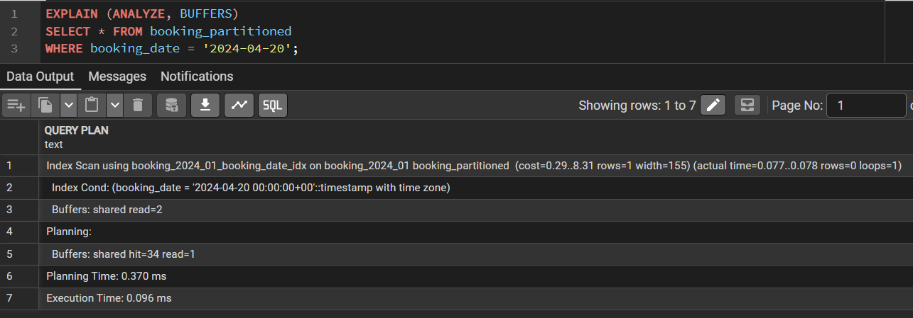

---

##List
```sql
CREATE TABLE booking_list_part (
    id integer NOT NULL,
    client_id integer NOT NULL,
    booking_date timestamp with time zone NOT NULL,
    total_cost integer NOT NULL,
    status_id integer NOT NULL,
    notes text,
    baggage_info jsonb
) PARTITION BY LIST (status_id);

CREATE TABLE booking_list_part_confirmed PARTITION OF booking_list_part
    FOR VALUES IN (1);
	
CREATE TABLE booking_list_part_cancelled PARTITION OF booking_list_part
    FOR VALUES IN (2);

CREATE TABLE booking_list_part_pending PARTITION OF booking_list_part
    FOR VALUES IN (3);

CREATE TABLE booking_list_part_other PARTITION OF booking_list_part
    DEFAULT;

INSERT INTO booking_list_part
SELECT * FROM booking;
```
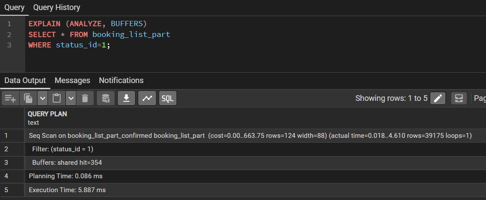
В запросе участвует 1 партиция
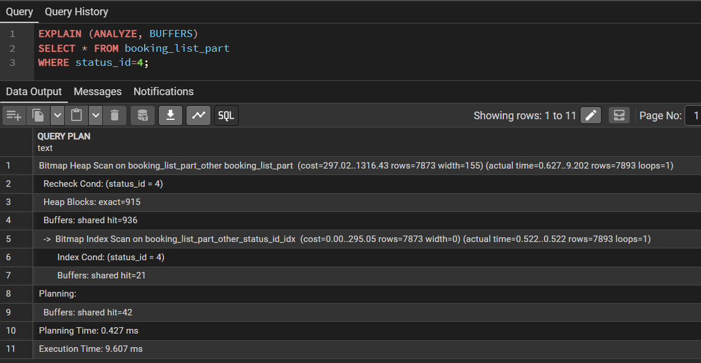

---

##Hash
```sql
CREATE TABLE booking_hash_part (
    id integer NOT NULL,
    client_id integer NOT NULL,
    booking_date timestamp with time zone NOT NULL,
    total_cost integer NOT NULL,
    status_id integer NOT NULL,
    notes text,
    baggage_info jsonb
) PARTITION BY HASH (client_id);

CREATE TABLE booking_hash_part_0 PARTITION OF booking_hash_part
    FOR VALUES WITH (MODULUS 4, REMAINDER 0);
    
CREATE TABLE booking_hash_part_1 PARTITION OF booking_hash_part
    FOR VALUES WITH (MODULUS 4, REMAINDER 1);
    
CREATE TABLE booking_hash_part_2 PARTITION OF booking_hash_part
    FOR VALUES WITH (MODULUS 4, REMAINDER 2);
    
CREATE TABLE booking_hash_part_3 PARTITION OF booking_hash_part
    FOR VALUES WITH (MODULUS 4, REMAINDER 3);

INSERT INTO booking_hash_part
SELECT * FROM booking;
```
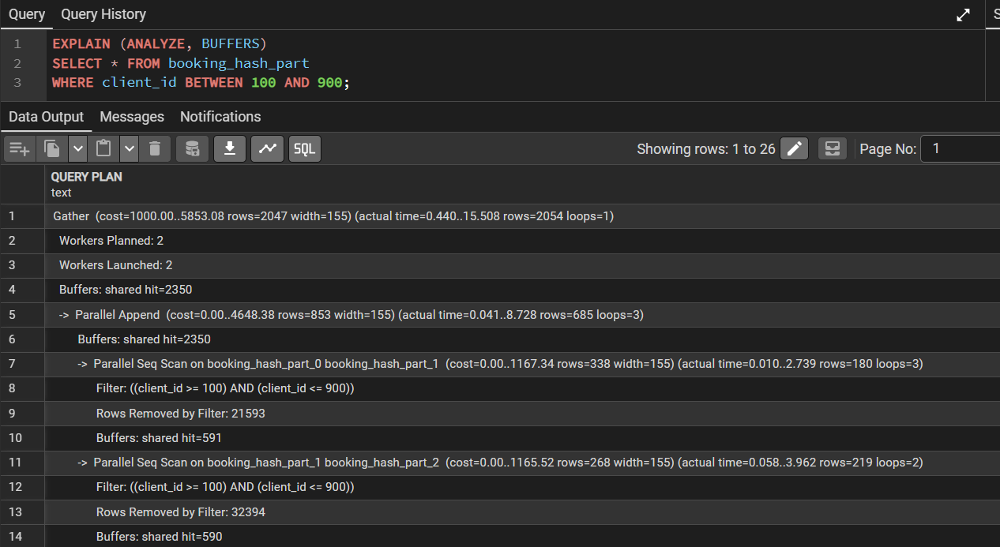
В запросе участвуют все партиции
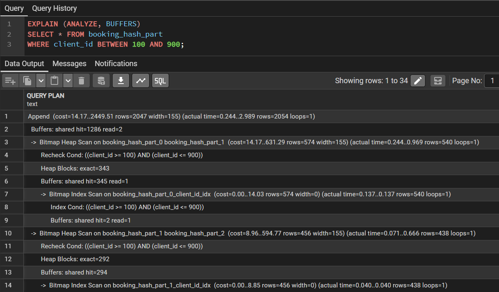

---

Физическая репликация не знает про секции потому что она работает на уровне WAL, поэтому она копирует секции как часть файлов данных, но не управляет ими как отдельными объектами.

---

Логическая репликация работает на уровне логических операций и подписывается на конкретные таблицы. Секции — это отдельные таблицы, и если они созданы после публикации, репликация о них не знает.
```sql
SELECT * FROM pg_class WHERE relkind = 'p';
```
publish_via_partition_root = off - Если на мастере добавить новую секцию, на реплике её нужно создавать вручную
```sql
CREATE PUBLICATION my_pub FOR TABLE orders WITH (publish_via_partition_root = true);
```
publish_via_partition_root = on - Новые секции на реплике создаются автоматически

---

#Шардирование
```yml
version: '3.8'

services:
  shard1:
    image: postgres:17
    environment:
      POSTGRES_DB: shard1
      POSTGRES_USER: shard_user
      POSTGRES_PASSWORD: shard_pass
    ports:
      - "5432:5432"
    volumes:
      - shard1_data:/var/lib/postgresql/data
    command: >
      postgres
      -c shared_preload_libraries=postgres_fdw
    networks:
      - sharding_network

  shard2:
    image: postgres:17
    environment:
      POSTGRES_DB: shard2
      POSTGRES_USER: shard_user
      POSTGRES_PASSWORD: shard_pass
    ports:
      - "5433:5432"
    volumes:
      - shard2_data:/var/lib/postgresql/data
    command: >
      postgres
      -c shared_preload_libraries=postgres_fdw
    networks:
      - sharding_network

  router:
    image: postgres:17
    environment:
      POSTGRES_DB: router
      POSTGRES_USER: router_user
      POSTGRES_PASSWORD: router_pass
    ports:
      - "5434:5432"
    depends_on:
      - shard1
      - shard2
    command: >
      postgres
      -c shared_preload_libraries=postgres_fdw
    networks:
      - sharding_network

  pgadmin:
    image: dpage/pgadmin4:latest
    environment:
      PGADMIN_DEFAULT_EMAIL: admin@admin.com
      PGADMIN_DEFAULT_PASSWORD: admin123
      PGADMIN_CONFIG_SERVER_MODE: 'False'
    ports:
      - "5050:80"
    depends_on:
      - shard1
      - shard2
      - router
    networks:
      - sharding_network
    volumes:
      - pgadmin_data:/var/lib/pgadmin

volumes:
  shard1_data:
  shard2_data:
  pgadmin_data:

networks:
  sharding_network:
    driver: bridge
```
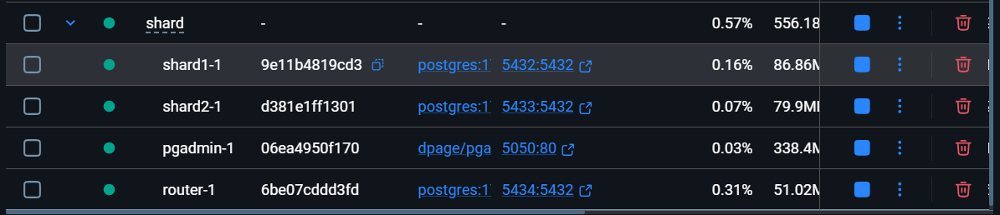
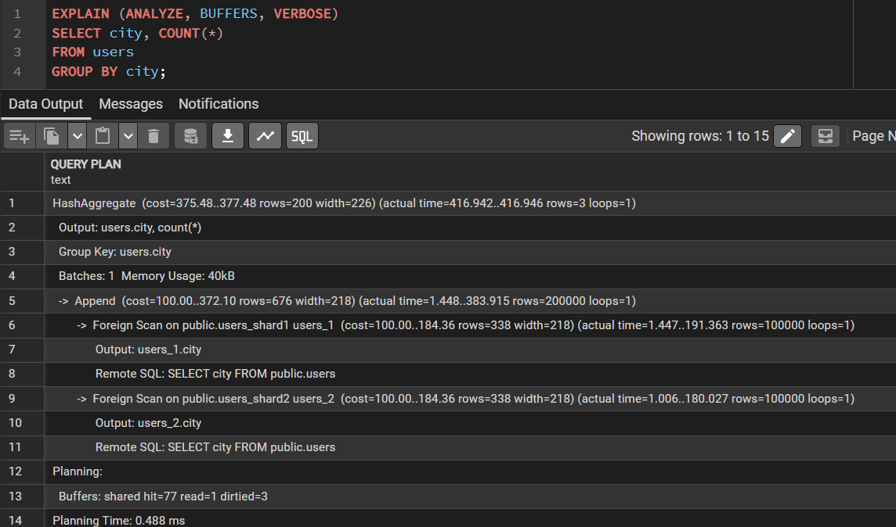
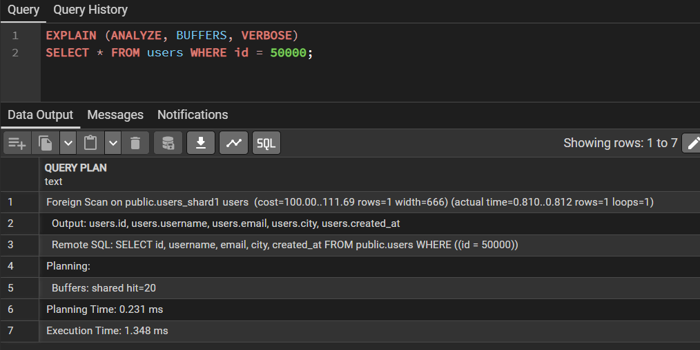
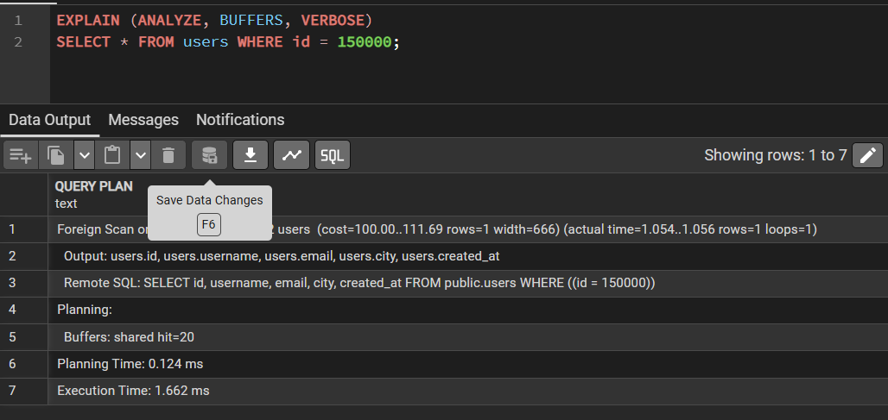
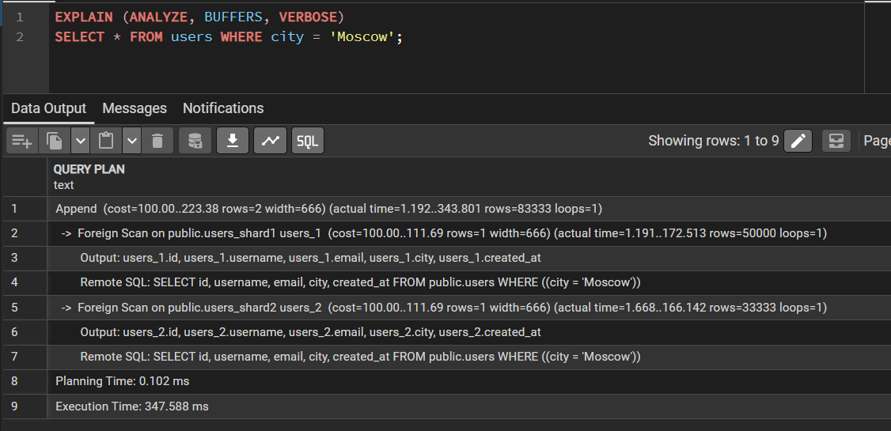
```sql
EXPLAIN (ANALYZE, BUFFERS, VERBOSE) 
SELECT id, username, city 
FROM users 
WHERE id BETWEEN 50000 AND 150000 
AND city IN ('Moscow', 'Kazan')
ORDER BY id
LIMIT 100;
```
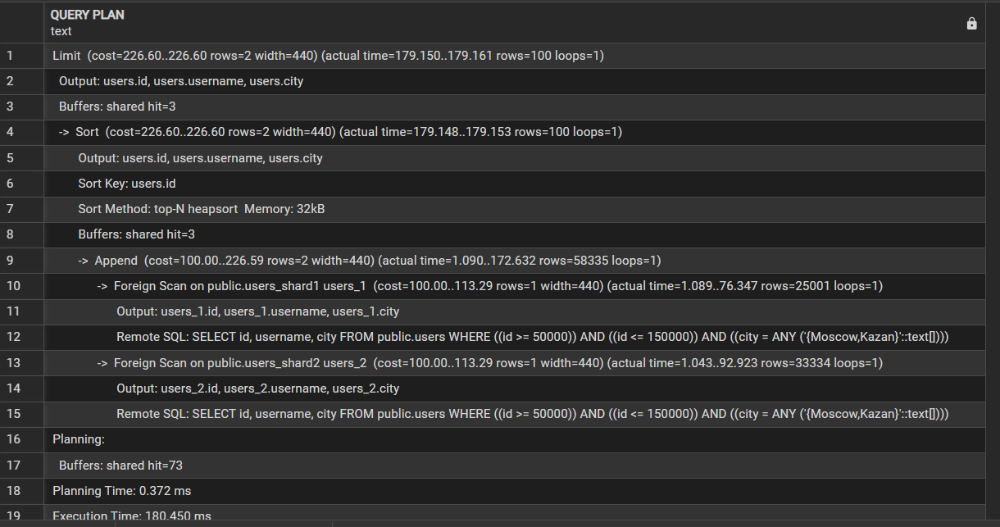
