1.
```sql
explain analyze
select * from flight where status_id = 3;
```

---
```sql
explain (analyze, buffers)
select * from flight where status_id = 3;
```

---
btree
```sql
CREATE INDEX idx_flight_status_btree ON flight USING btree (status_id);
explain (analyze, buffers)
select * from flight where status_id = 3;
```
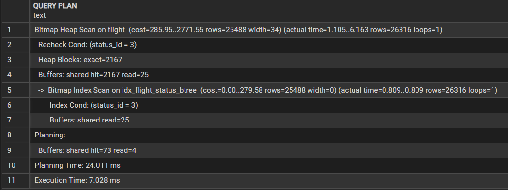
---
hash
```sql
CREATE INDEX idx_flight_status_hash ON flight USING hash (status_id);
explain (analyze, buffers)
select * from flight where status_id = 3;
```

2.
```sql
explain analyze
select * from flight where flight_number = 'SU154';
```

---
```sql
explain (analyze, buffers)
select * from flight where flight_number = 'SU154';
```

---
btree
```sql
CREATE INDEX idx_flight_number_btree ON flight USING btree (flight_number);
explain (analyze, buffers)
select * from flight where flight_number = 'SU154';
```
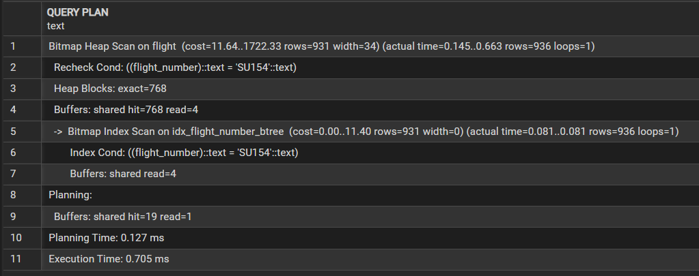
---
hash
```sql
CREATE INDEX idx_flight_number_hash ON flight USING hash (flight_number);
explain (analyze, buffers)
select * from flight where flight_number = 'SU154';
```
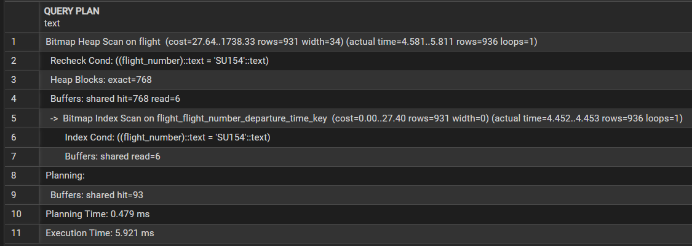
3.
```sql
explain analyze
select * from client where loyalty_level = 'SILVER';
```

---
```sql
explain (analyze, buffers)
select * from client where loyalty_level = 'SILVER';
```

---
btree
```sql
CREATE INDEX idx_client_loyalty ON client USING btree (loyalty_level);
explain (analyze, buffers)
select * from client where loyalty_level = 'SILVER';
```
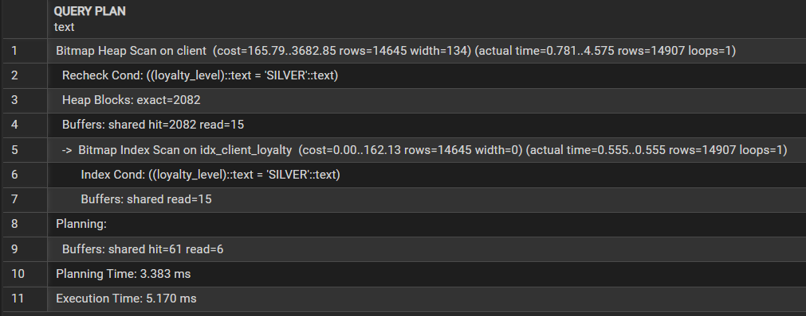
---
hash
```sql
CREATE INDEX idx_client_loyalty ON client USING hash (loyalty_level);
explain (analyze, buffers)
select * from client where loyalty_level = 'SILVER';
```
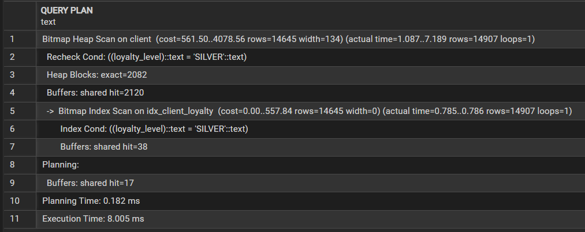
4.
```sql
explain analyze
select * from fare where price < 20000;
```

---
```sql
explain (analyze, buffers)
select * from fare where price < 20000;
```

---
btree
```sql
CREATE INDEX idx_fare_price ON fare USING btree (price);
explain (analyze, buffers)
select * from fare where price < 20000;
```
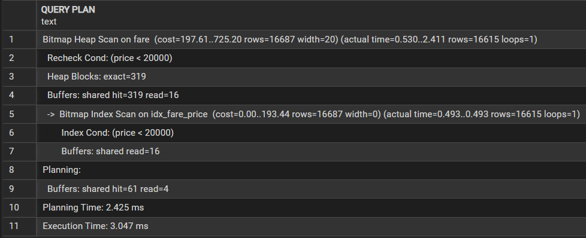
---
hash
```sql
CREATE INDEX idx_fare_price ON fare USING hash (price);
explain (analyze, buffers)
select * from fare where price < 20000;
```
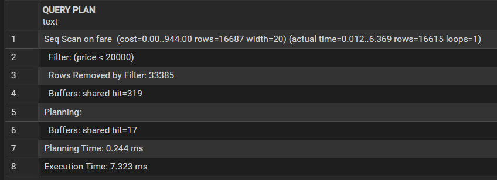

5.
```sql
explain analyze
select * from payment where payment_method_id = 1;
```
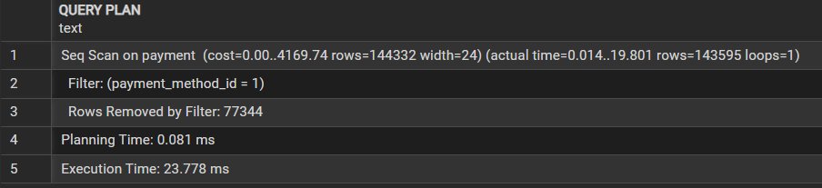
---
```sql
explain (analyze, buffers)
select * from payment where payment_method_id = 1;
```
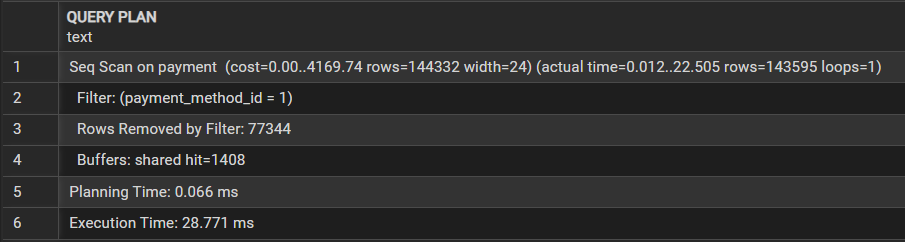
---
btree
```sql
CREATE INDEX idx_payment on payment using btree (payment_method_id);
explain (analyze, buffers)
select * from payment where payment_method_id = 1;
```
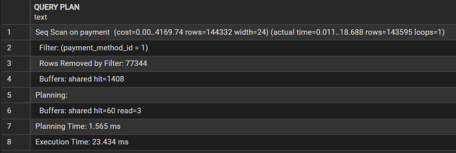
---
hash
```sql
CREATE INDEX idx_payment on payment using hash (payment_method_id);
explain (analyze, buffers)
select * from payment where payment_method_id = 1;
```
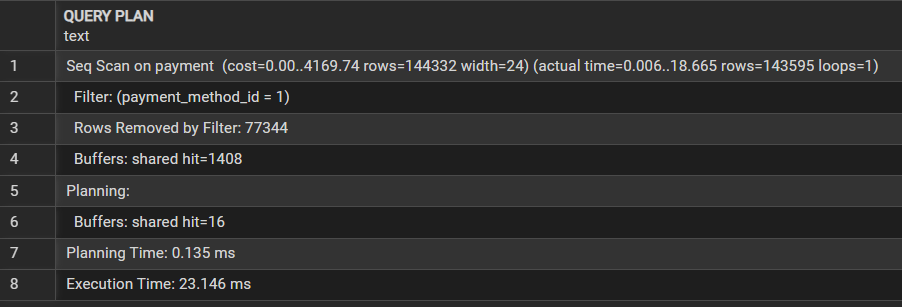
