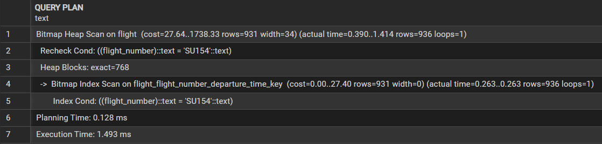
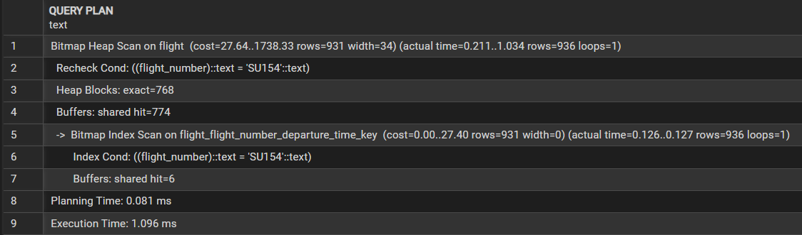
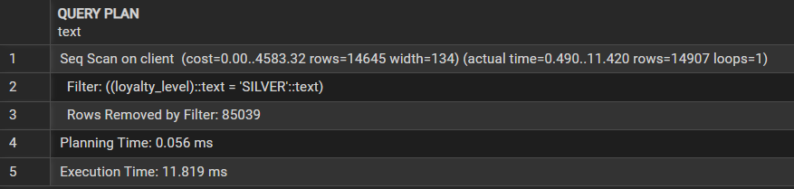
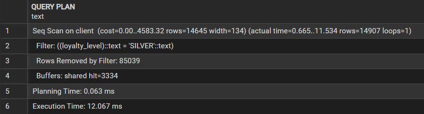
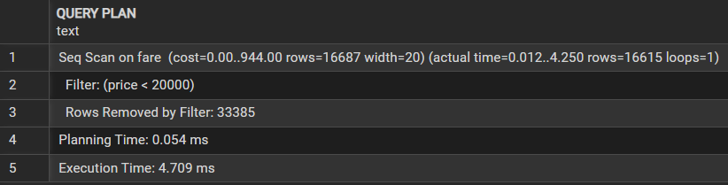
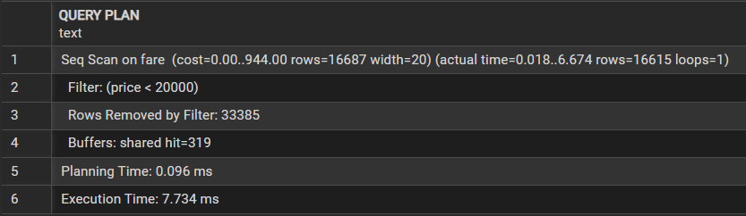

1.
```sql
explain analyze
select * from flight where status_id = 3;
```

---
```sql
explain (analyze, buffers)
select * from flight where status_id = 3;
```


2.
```sql
explain analyze
select * from flight where flight_number = 'SU154';
```

---
```sql
explain (analyze, buffers)
select * from flight where flight_number = 'SU154';
```


3.
```sql
explain analyze
select * from client where loyalty_level = 'SILVER';
```

---
```sql
explain (analyze, buffers)
select * from client where loyalty_level = 'SILVER';
```


4.
```sql
explain analyze
select * from fare where price < 20000;
```

---
```sql
explain (analyze, buffers)
select * from fare where price < 20000;
```

