GIN


1. Поиск вегетерианцев (JSONB в client.preferences)

```sql
CREATE INDEX idx_gin_client_preferences ON client USING gin (preferences);

EXPLAIN (ANALYZE, BUFFERS)
SELECT id, first_name, last_name, email, preferences
FROM client
WHERE preferences @> '{"meal": "vegetarian"}';
```


2. Поиск бронирований со спортивным инвентарем (JSONB в booking.baggage_info)
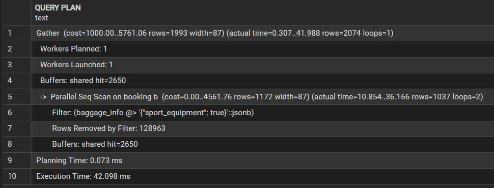
```sql
CREATE INDEX idx_gin_booking_baggage ON booking USING gin (baggage_info);

EXPLAIN (ANALYZE, BUFFERS)
SELECT b.id, b.client_id, b.booking_date, b.baggage_info
FROM booking b
WHERE b.baggage_info @> '{"sport_equipment": true}';
```
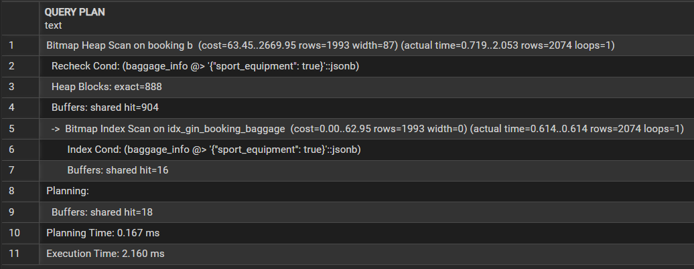


3. Поиск клиентов по наличию уведомлений (JSONB в client.preferences)
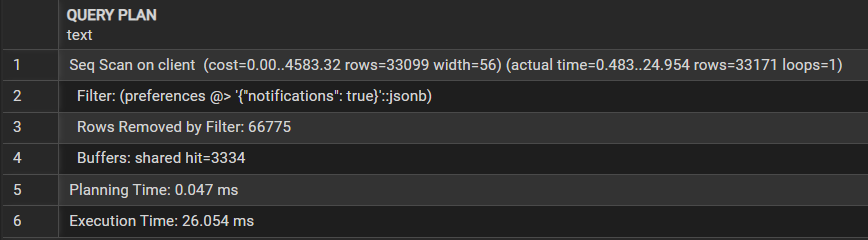
```sql
CREATE INDEX idx_gin_client_preferences ON client USING gin (preferences);

EXPLAIN (ANALYZE, BUFFERS)
SELECT id, first_name, last_name, email
FROM client
WHERE preferences @> '{"notification": true}';
```
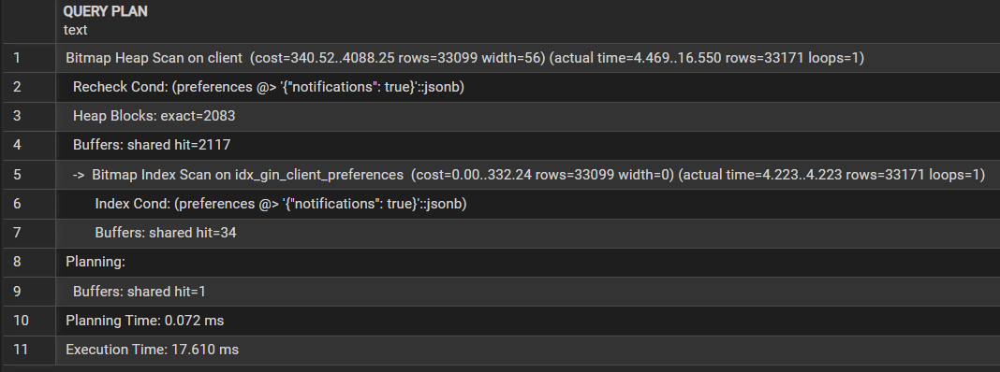


4. Поиск бронирований с весом багажа более 20кг

(Индекс не участвует в сравнении >20, но быстрее фильтрует записи, где есть поле weight)
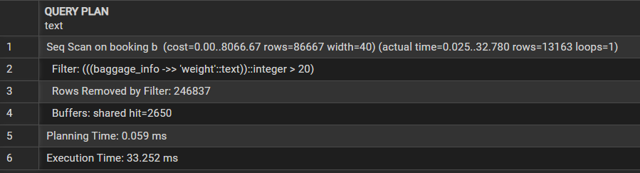
```sql
CREATE INDEX idx_gin_booking_baggage ON booking USING gin (baggage_info);

EXPLAIN (ANALYZE, BUFFERS)
SELECT b.id, b.client_id, b.baggage_info->>'weight' as weight
FROM booking b
WHERE (b.baggage_info->>'weight')::int > 20;
```
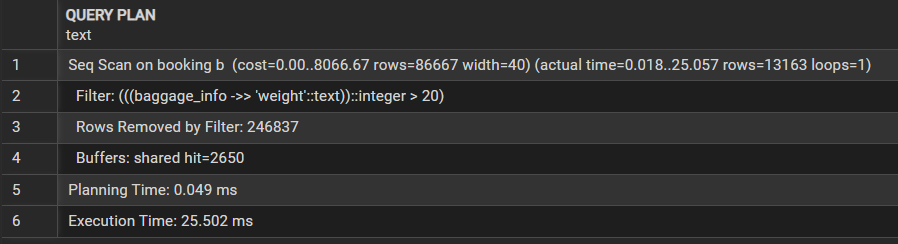


5. Поиск по названию аэропорта
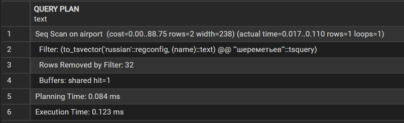
```sql
CREATE INDEX idx_gin_airport_name_ru ON airport USING gin (to_tsvector('russian', name));

EXPLAIN (ANALYZE, BUFFERS)
SELECT iata_code, name, city_id
FROM airport
WHERE to_tsvector('russian', name) @@ to_tsquery('russian', 'шереметьево');
```
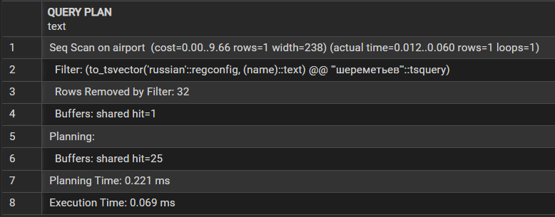


GIST
1. Поиск рейсов в определенную дату
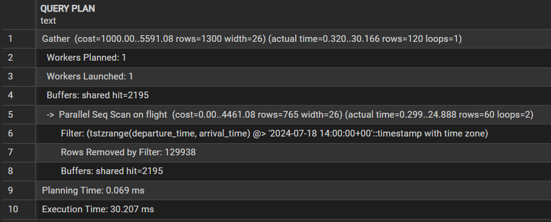
```sql
CREATE INDEX idx_gist_flight_duration ON flight USING gist (tstzrange(departure_time, arrival_time));

EXPLAIN (ANALYZE, BUFFERS)
SELECT id, flight_number, departure_time, arrival_time
FROM public.flight
WHERE tstzrange(departure_time, arrival_time) @> timestamp with time zone '2024-07-18 14:00:00+00';
```
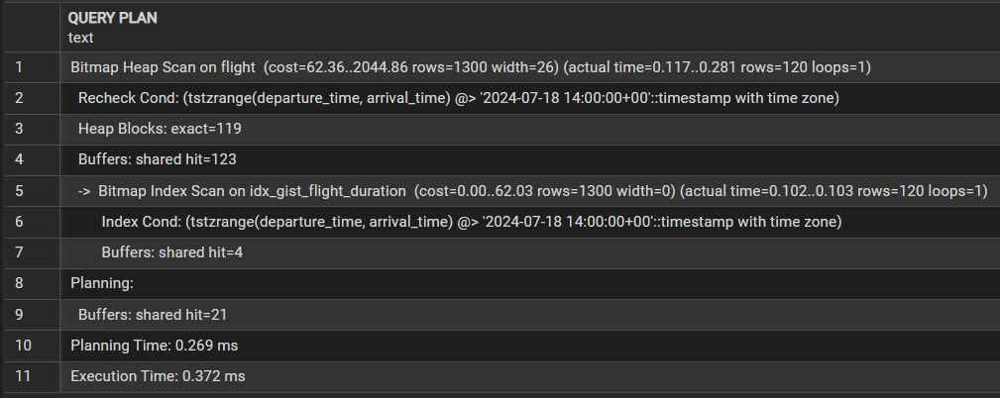


2. Поиск пересекающихся по времени рейсов
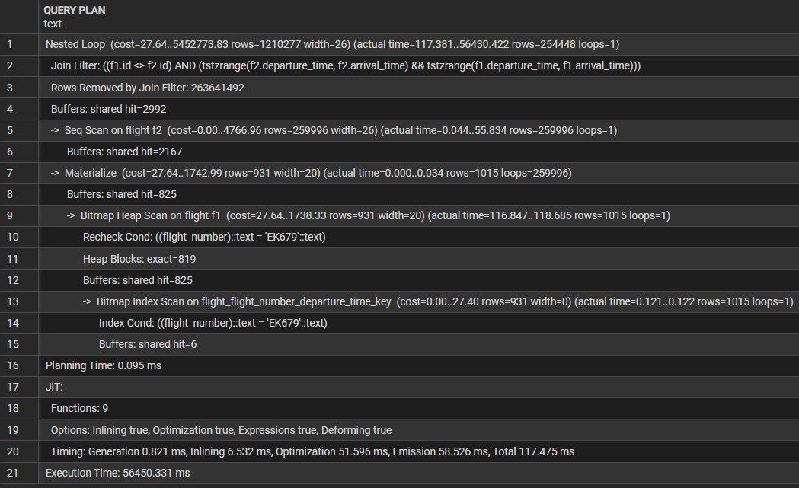
```sql
CREATE INDEX idx_gist_flight_duration ON flight USING gist (tstzrange(departure_time, arrival_time));

EXPLAIN (ANALYZE, BUFFERS)
SELECT f2.id, f2.flight_number, f2.departure_time, f2.arrival_time
FROM public.flight f1
JOIN public.flight f2 ON f1.id != f2.id
WHERE f1.flight_number = 'EK679' 
  AND tstzrange(f2.departure_time, f2.arrival_time) 
      && tstzrange(f1.departure_time, f1.arrival_time)
```
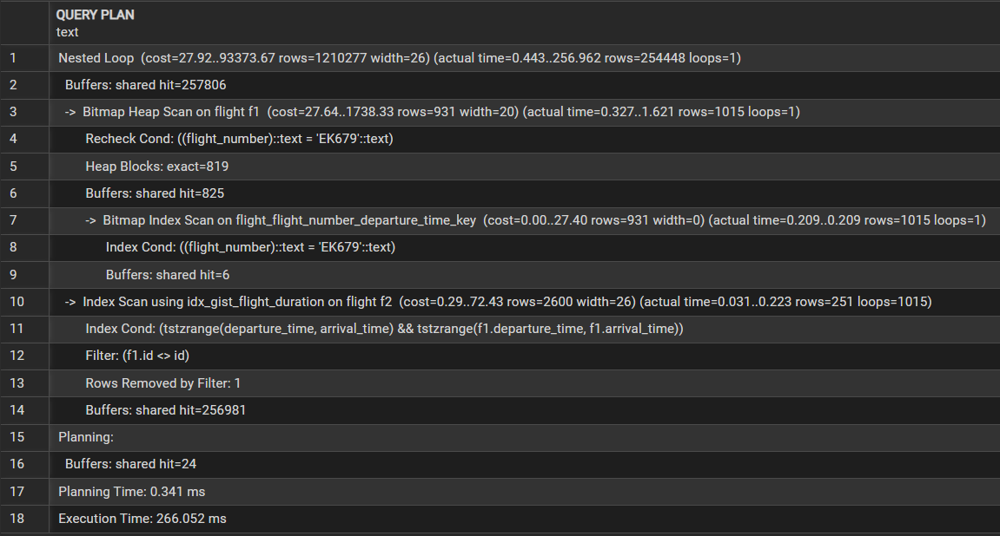


3. Нечеткий поиск города
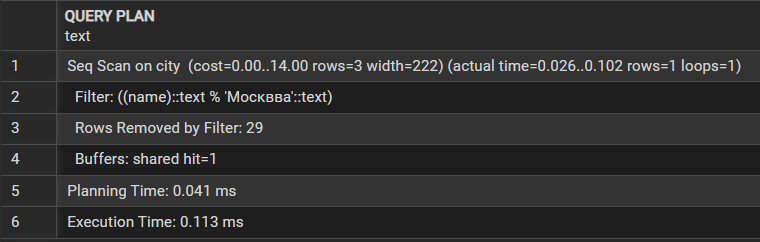
```sql
CREATE EXTENSION IF NOT EXISTS pg_trgm;
CREATE INDEX idx_gist_city_name_trgm ON city USING gist (name gist_trgm_ops);
EXPLAIN (ANALYZE, BUFFERS)
SELECT id, name FROM city WHERE name % 'Москвва'
```
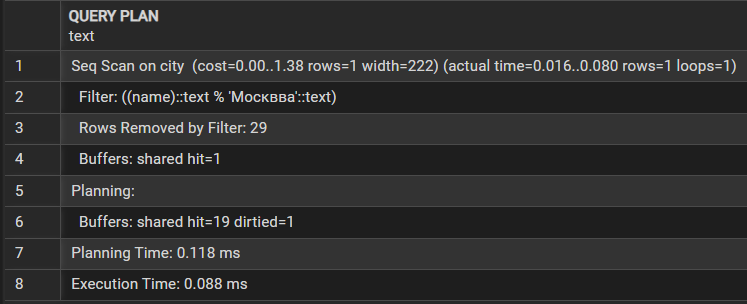


4. Нечеткий поиск по фамилии пассажира
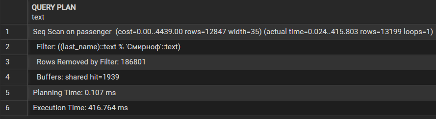
```sql
CREATE INDEX idx_gist_passenger_lastname_trgm ON passenger USING gist (last_name gist_trgm_ops);
EXPLAIN (ANALYZE, BUFFERS)
SELECT id, first_name, last_name, birthdate
FROM passenger
WHERE last_name % 'Смирноф'
```
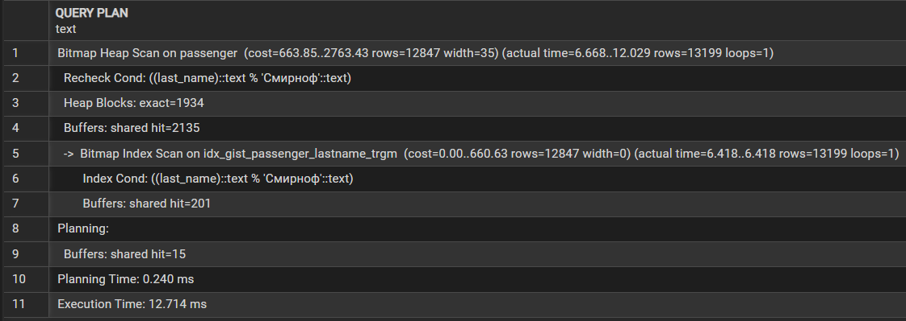


5. Поиск рейсов, которые полностью находятся в заданном периоде
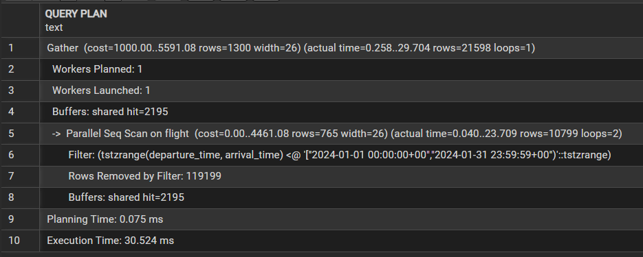
```sql
CREATE INDEX idx_gist_flight_duration ON flight USING gist (tstzrange(departure_time, arrival_time));
EXPLAIN (ANALYZE, BUFFERS)
SELECT id, flight_number, departure_time, arrival_time
FROM flight
WHERE tstzrange(departure_time, arrival_time) <@ 
      tstzrange('2024-01-01 00:00:00+00', '2024-01-31 23:59:59+00');
```
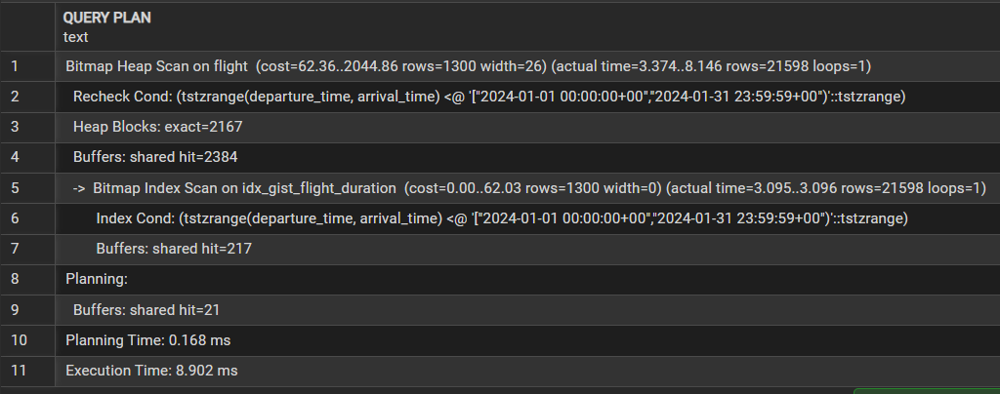


JOIN


1. Nested loop
Ищем конкретного клиента по ID (c.id = 1). БД сначала находит 1 строку в client по первичному ключу (Index Scan), затем для этой строки ищет связанные бронирования в booking по индексу. 
```sql
EXPLAIN (ANALYZE, BUFFERS)
SELECT c.first_name, c.last_name, b.id, b.booking_date
FROM client c
JOIN booking b ON c.id = b.client_id
WHERE c.id = 1;
```
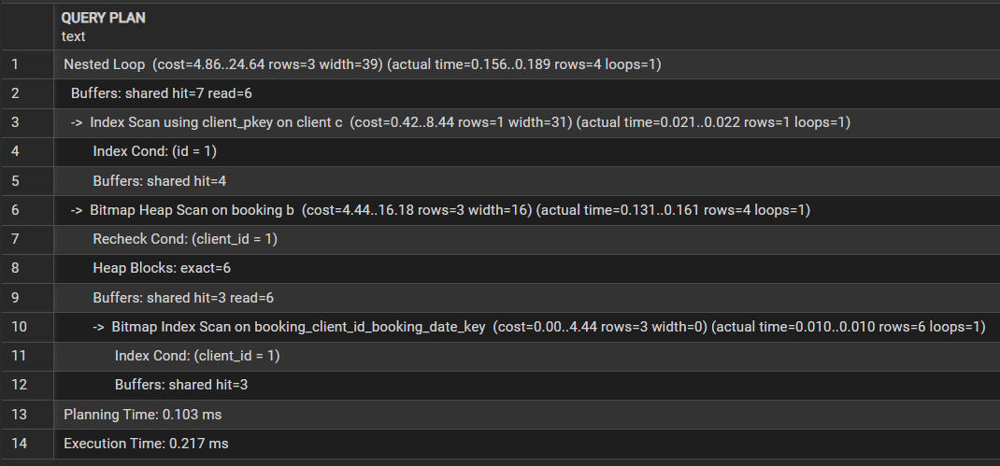


2. Nested loop
Ищем конкретное бронирование по ID (b.id = 1). Сначала находится одна строка в booking, затем по индексу ищутся связанные билеты.
```sql
EXPLAIN (ANALYZE, BUFFERS)
SELECT b.id, b.booking_date, t.id, t.seat_number
FROM booking b
JOIN ticket t ON b.id = t.booking_id
WHERE b.id = 1;
```
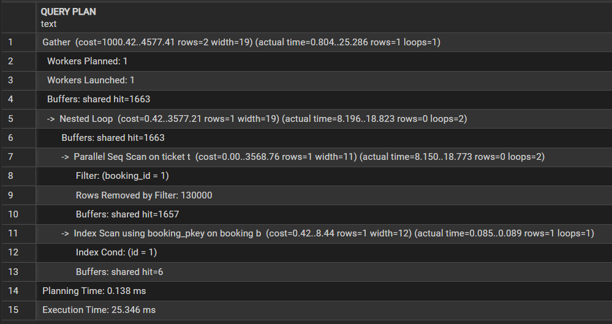


3. Hash join
Условие WHERE b.total_cost > 40000 не индексировано. БД сканирует всю таблицу booking, строит хэш-таблицу, затем сканирует ticket и ищет совпадения.
```sql
EXPLAIN (ANALYZE, BUFFERS)
SELECT b.id, b.booking_date, t.id, t.seat_number
FROM booking b
JOIN ticket t ON b.id = t.booking_id
WHERE b.total_cost > 40000;
```
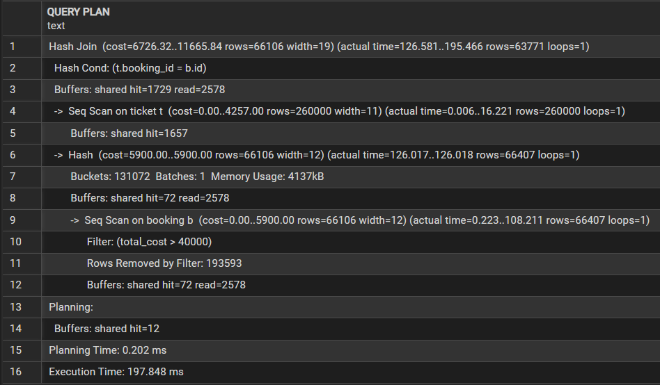


4. Merge join
Запрос требует сортировки по f.id. БД использует уже отсортированные данные из индексов первичных ключей (flight.id и ticket.flight_id) и выполняет Merge Join, сливая два отсортированных набора.
```sql
EXPLAIN (ANALYZE, BUFFERS)
SELECT f.flight_number, f.departure_time, t.id, t.seat_number
FROM flight f
JOIN ticket t ON f.id = t.flight_id
ORDER BY f.id;
```
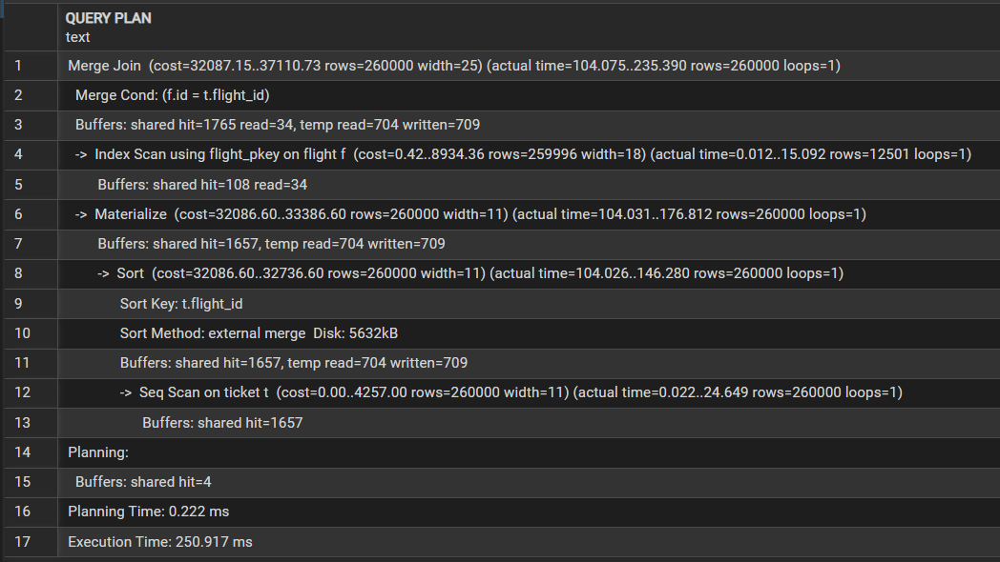


5. Hash join
Аналогично третьему.
```sql
EXPLAIN (ANALYZE, BUFFERS)
SELECT a.name, c.name
FROM airport a
JOIN city c ON a.city_id = c.id
WHERE a.city_id > 5;
```
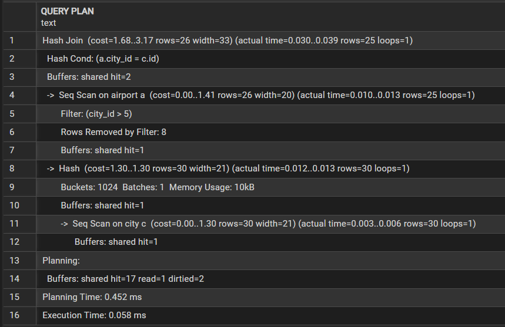


MVCC
1)
```sql
CREATE TABLE mvcc_test (
    id serial primary key,
    name text,
    age integer
);

INSERT INTO mvcc_test (name, age) VALUES ('Иван', 25);
CREATE EXTENSION pageinspect;

SELECT ctid FROM mvcc_test WHERE id = 1;

SELECT t_xmin, t_xmax, t_ctid, t_infomask::text, t_infomask2::text
FROM heap_page_items(get_raw_page('mvcc_test', 0));
```

```sql
UPDATE mvcc_test SET age = 26 WHERE id = 1;
SELECT t_xmin, t_xmax, t_ctid, t_infomask::text, t_infomask2::text
FROM heap_page_items(get_raw_page('mvcc_test', 0));
```
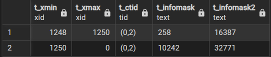
2)
1. t_infomask = 258:
    HEAP_HASVARWIDTH - есть поле переменной длины (text)
    HEAP_XMAX_COMMITTED - транзакция 1250 закоммичена
2. t_infomask = 10242
    HEAP_HASVARWIDTH - есть поле переменной длины
    HEAP_XMIN_COMMITTED - создавшая транзакция (1250) закоммичена
    HEAP_XMAX_INVALID - xmax = 0 (строка актуальна)
    HEAP_UPDATED - строка была создана в результате UPDATE


3) 
Первая транзакция:
```sql
BEGIN;
UPDATE mvcc_test SET age = 30 WHERE id = 1;
SELECT ctid, xmin, xmax, age FROM mvcc_test WHERE id = 1;
```
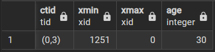
Вторая транзакция:
```sql
BEGIN;
SELECT ctid, xmin, xmax, age FROM mvcc_test WHERE id = 1;
```
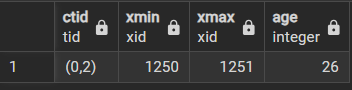


4)
Первая транзакция:
```sql
BEGIN;
UPDATE mvcc_test SET age = 26 WHERE id = 1;
```
Вторая транзакция:
```sql
BEGIN;
UPDATE mvcc_test SET age = 31 WHERE id = 2;
```
Первая:
```sql
UPDATE mvcc_test SET age = 32 WHERE id = 2;
```
Вторая:
```sql
UPDATE mvcc_test SET age = 27 WHERE id = 1;
```
Каждая транзакция попытается обновить строку, заблокированную другой.
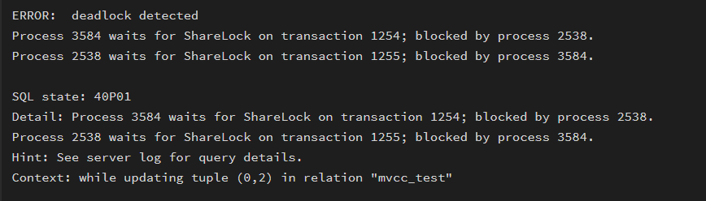

5)
Первая транзакция:
```sql
BEGIN;
SELECT * FROM mvcc_test WHERE id = 1 FOR UPDATE;
```
Вторая транзакция:
```sql
BEGIN;
SELECT * FROM mvcc_test WHERE id = 1 FOR UPDATE;
```
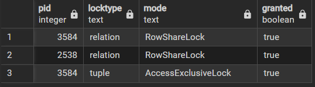
Первая транзакция:
```sql
BEGIN;
SELECT * FROM mvcc_test WHERE id = 1 FOR SHARE;
```
Вторая транзакция:
```sql
BEGIN;
UPDATE mvcc_test SET age = 26 WHERE id = 1;
```
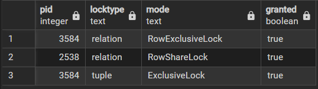
Первая транзакция:
```sql
BEGIN;
SELECT * FROM mvcc_test WHERE id = 1 FOR SHARE;
```
Вторая транзакция:
```sql
BEGIN;
SELECT * FROM mvcc_test WHERE id = 1 FOR SHARE;
```
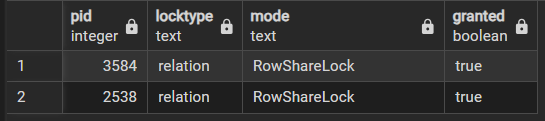
Итог: FOR SHARE - FOR SHARE выполняются сразу, остальные ждут друг друга.


6)
```sql
INSERT INTO mvcc_test (name, age) 
SELECT 'Пользователь ' || i, 20 + (i % 30)
FROM generate_series(1, 1000) i;

SELECT 
    schemaname,
    relname,
    n_live_tup as живых_строк,
    n_dead_tup as мертвых_строк,
    last_vacuum,
    last_autovacuum,
    vacuum_count as раз_вакуумили
FROM pg_stat_all_tables 
WHERE relname = 'mvcc_test';
```
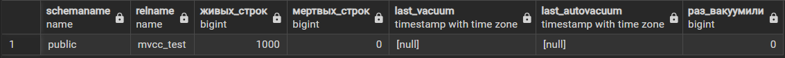
```sql
UPDATE mvcc_test SET age = age + 1 WHERE id <= 200;

SELECT n_live_tup, n_dead_tup FROM pg_stat_all_tables 
WHERE relname = 'mvcc_test';
```
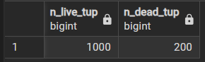
```sql
VACUUM mvcc_test;

SELECT 
    n_live_tup,
    n_dead_tup,
    last_vacuum
FROM pg_stat_all_tables 
WHERE relname = 'mvcc_test';
```
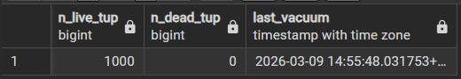
