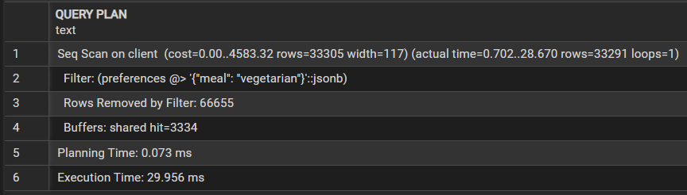
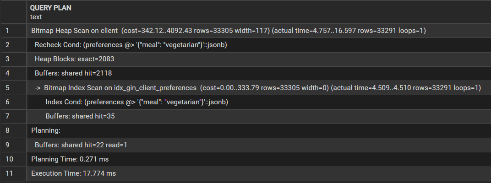

1. Поиск вегетерианцев (JSONB в client.preferences)

```sql
CREATE INDEX idx_gin_client_preferences ON client USING gin (preferences);

EXPLAIN (ANALYZE, BUFFERS)
SELECT id, first_name, last_name, email, preferences
FROM public.client
WHERE preferences @> '{"meal": "vegetarian"}';
```

