1) Сравнение LSN до и после INSERT
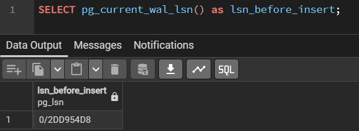
```sql
INSERT INTO city (name) VALUES ('Сидней');
```
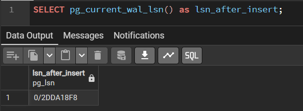
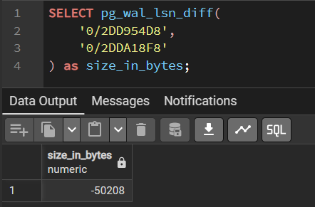


2) Сравнение WAL до и после commit
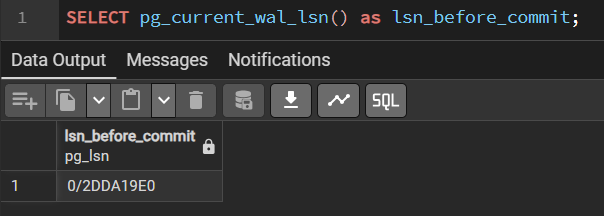
```sql
BEGIN;
INSERT INTO city (name) VALUES ('Дубай');
COMMIT;
```
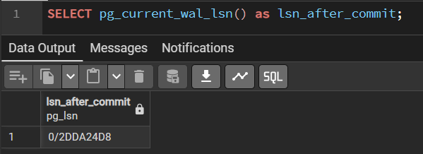


3) Анализ WAL размера после массовой операции
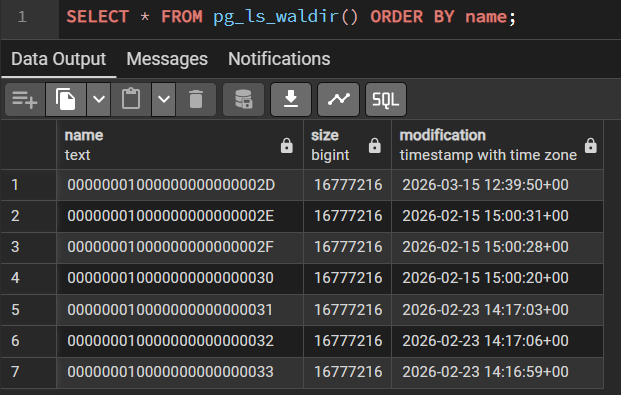
```sql
INSERT INTO passenger (first_name, last_name, birthdate, passport_series, passport_number)
SELECT 
    'FirstName' || generate_series,
    'LastName' || generate_series,
    '1990-01-01'::date + (random() * 365*30)::int,
    lpad((generate_series % 10000)::text, 4, '0'),
    lpad((generate_series % 1000000)::text, 6, '0')
FROM generate_series(1, 50000);
```
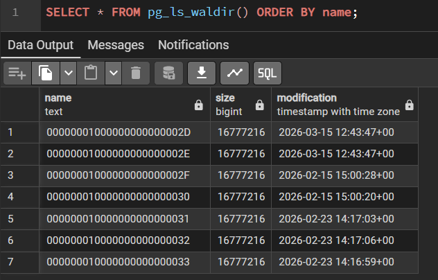
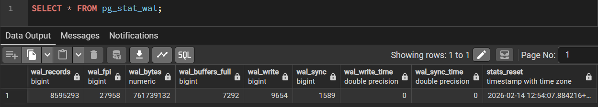


4) Dump только структуры базы, только 1 таблицы
```txt
docker exec -t pg_course pg_dump -U postgres -d flytics -s > flytics_structure.sql
```
```txt
docker exec -t pg_course pg_dump -U postgres -d flytics -t aircraft > aircraft_table.sql
```
(дампы лежат в папке images)
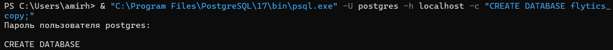
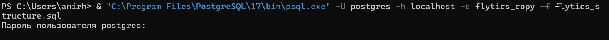
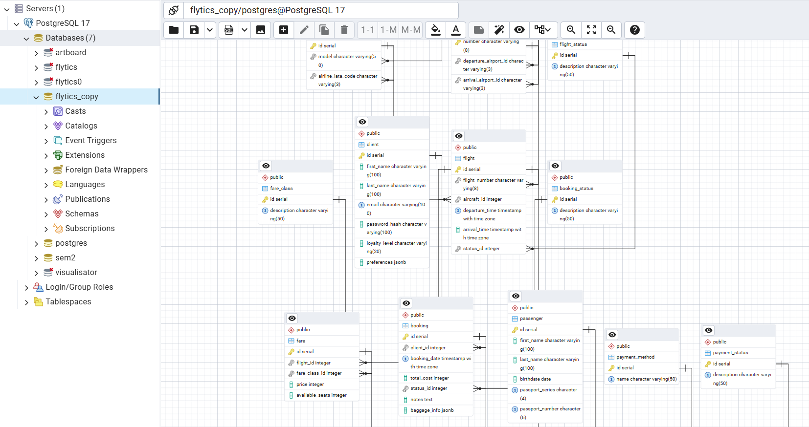
```txt
& "C:\Program Files\PostgreSQL\17\bin\psql.exe" -U postgres -h localhost -d flytics_copy -f flytics_seed.sql
```
Проверка идемпотентности:
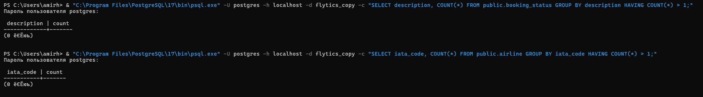
