Physical replication
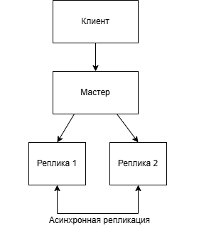
```yml
version: '3.9'

services:
  master:
    image: postgres:15
    container_name: pg_master
    environment:
      POSTGRES_USER: postgres
      POSTGRES_PASSWORD: 7777
      POSTGRES_DB: app_db
    ports:
      - "5432:5432"
    volumes:
      - ./master_data:/var/lib/postgresql/data
      - ./init:/docker-entrypoint-initdb.d
    command: >
      postgres
      -c wal_level=replica
      -c max_wal_senders=10
      -c max_replication_slots=10
      -c listen_addresses='*'
    networks:
      - pg_network

  replica1:
    image: postgres:15
    container_name: pg_replica1
    environment:
      POSTGRES_USER: postgres
      POSTGRES_PASSWORD: 7777
      POSTGRES_DB: app_db
    ports:
      - "5433:5432"
    depends_on:
      - master
    volumes:
      - ./replica1_data:/var/lib/postgresql/data
    networks:
      - pg_network

  replica2:
    image: postgres:15
    container_name: pg_replica2
    environment:
      POSTGRES_USER: postgres
      POSTGRES_PASSWORD: 7777
      POSTGRES_DB: app_db
    ports:
      - "5434:5432"
    depends_on:
      - master
    volumes:
      - ./replica2_data:/var/lib/postgresql/data
    networks:
      - pg_network
  
  pgadmin:
    image: dpage/pgadmin4:latest
    container_name: pgadmin_1
    environment:
      PGADMIN_DEFAULT_EMAIL: admin@admin.com
      PGADMIN_DEFAULT_PASSWORD: admin123
      PGADMIN_CONFIG_SERVER_MODE: 'False'
    ports:
      - "5050:80"
    volumes:
      - ./pgadmin_data:/var/lib/pgadmin
    networks:
      - pg_network
    depends_on:
      - master
      - replica1
      - replica2

networks:
  pg_network:
    driver: bridge
```
---

```conf
host replication replicator 0.0.0.0/0 md5
host all all 0.0.0.0/0 md5
```
---

```sql
CREATE ROLE replicator WITH REPLICATION LOGIN PASSWORD 'replica_pass';
GRANT CONNECT ON DATABASE app_db TO replicator;
GRANT USAGE ON SCHEMA public TO replicator;
GRANT SELECT ON ALL TABLES IN SCHEMA public TO replicator;
```
---

```bash
docker-compose run --rm replica1 bash -c "
    pg_basebackup -h pg_master -U replicator -D /var/lib/postgresql/data \
    -P -R --wal-method=stream
"
docker-compose run --rm replica2 bash -c "
    pg_basebackup -h pg_master -U replicator -D /var/lib/postgresql/data \
    -P -R --wal-method=stream
"
```
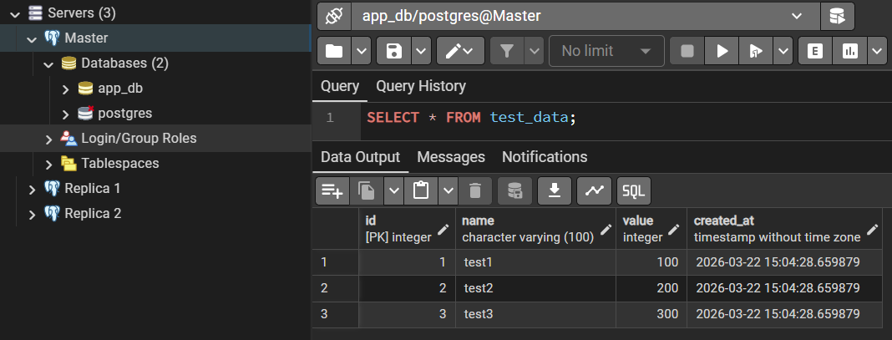
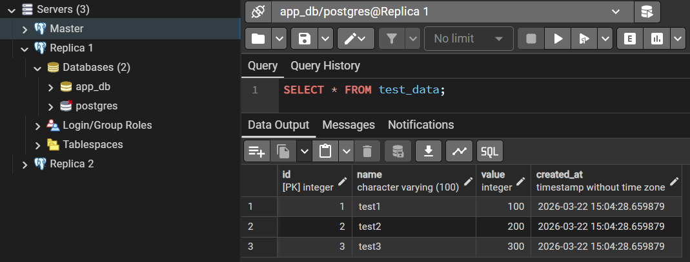
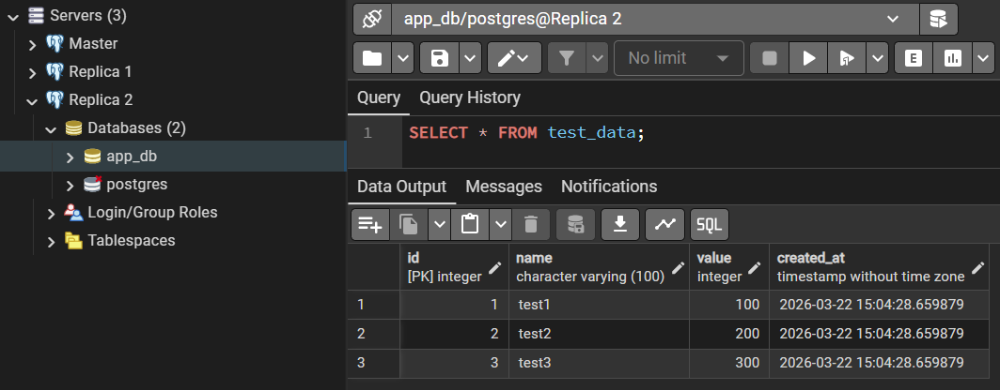

---
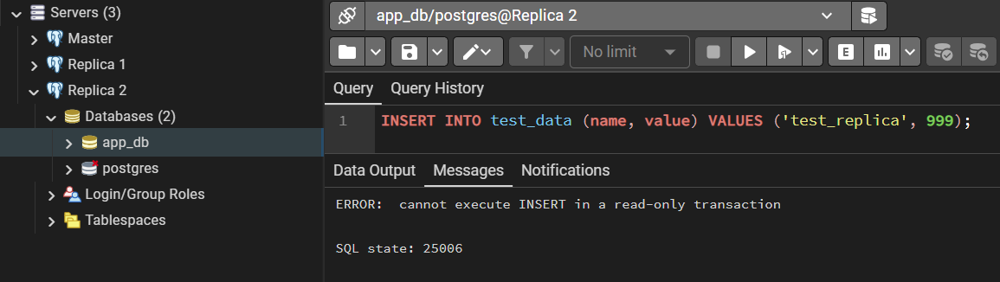

---
```sql
CREATE TABLE load_test (
    id SERIAL PRIMARY KEY,
    data TEXT,
    created_at TIMESTAMP DEFAULT CURRENT_TIMESTAMP
);

DO $$
BEGIN
    FOR i IN 1..100000 LOOP
        INSERT INTO load_test (data) VALUES ('Heavy load ' || i);
        IF i % 1000 = 0 THEN
            COMMIT;
        END IF;
    END LOOP;
END $$;
```
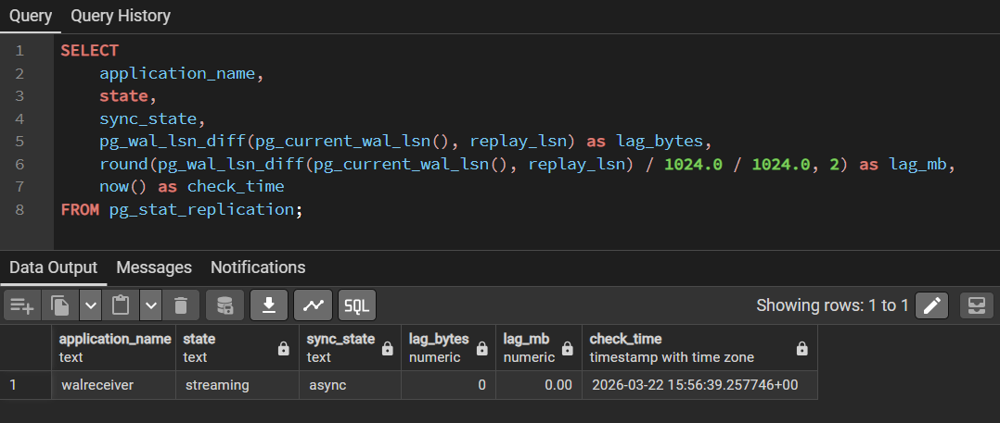
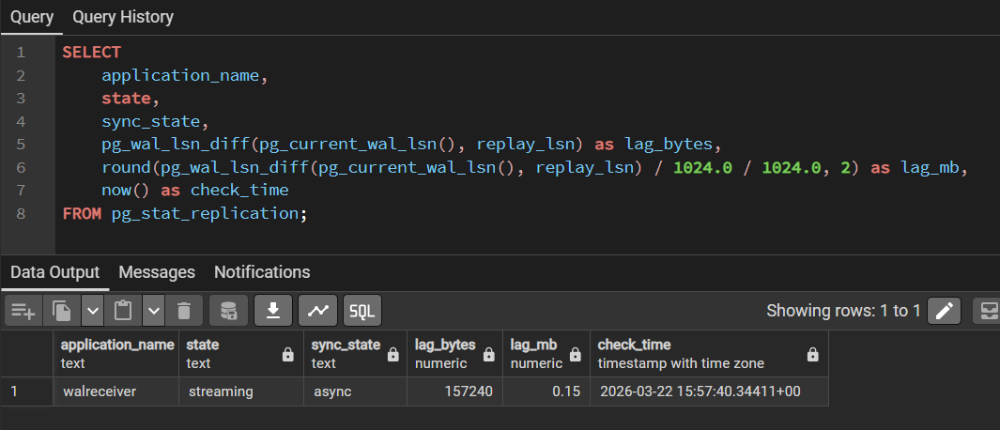


---

Logical replication

```yml
version: '3.9'

services:
  master:
    image: postgres:15
    container_name: logical_master
    environment:
      POSTGRES_USER: postgres
      POSTGRES_PASSWORD: 7777
      POSTGRES_DB: app_db
    ports:
      - "5435:5432"
    command: >
      postgres
      -c wal_level=logical
      -c max_wal_senders=10
      -c max_replication_slots=10
      -c listen_addresses='*'
    networks:
      - pg_network

  subscriber:
    image: postgres:15
    container_name: logical_subscriber
    environment:
      POSTGRES_USER: postgres
      POSTGRES_PASSWORD: 7777
      POSTGRES_DB: app_db
    ports:
      - "5436:5432"
    networks:
      - pg_network

  pgadmin:
    image: dpage/pgadmin4:latest
    container_name: pgadmin_logical
    environment:
      PGADMIN_DEFAULT_EMAIL: admin@admin.com
      PGADMIN_DEFAULT_PASSWORD: admin123
    ports:
      - "5051:80"
    networks:
      - pg_network

networks:
  pg_network:
    driver: bridge
```
---

Master:
```sql
CREATE TABLE users (
    id SERIAL PRIMARY KEY,
    name TEXT,
    email TEXT
);

CREATE TABLE logs (
    log_id INT,
    message TEXT
);

INSERT INTO users (name, email) VALUES ('Иван', 'ivan@mail.com'), ('Мария', 'maria@mail.com');
INSERT INTO logs VALUES (1, 'log 1'), (2, 'log 2');

CREATE PUBLICATION my_pub FOR TABLE users, logs;
```

В Subscriber DDL не реплицируются, создаем таблицы:
```sql
CREATE SUBSCRIPTION my_sub
CONNECTION 'host=logical_master port=5432 dbname=app_db user=postgres password=7777'
PUBLICATION my_pub;

CREATE TABLE users (
    id SERIAL PRIMARY KEY,
    name TEXT,
    email TEXT
);

CREATE TABLE logs (
    log_id INT,
    message TEXT
);
```
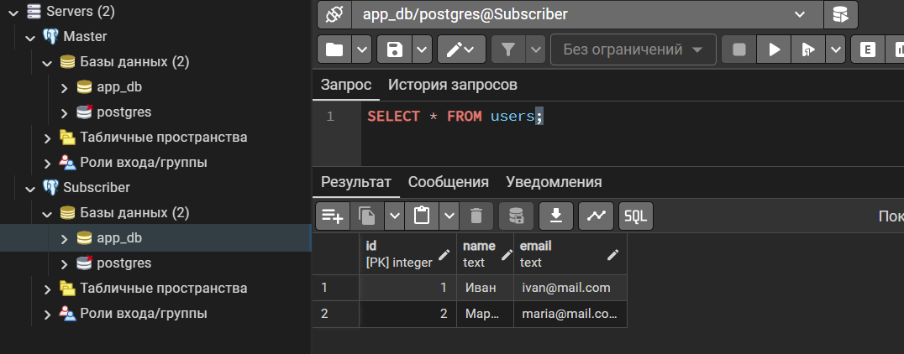

---

Вставка в Master
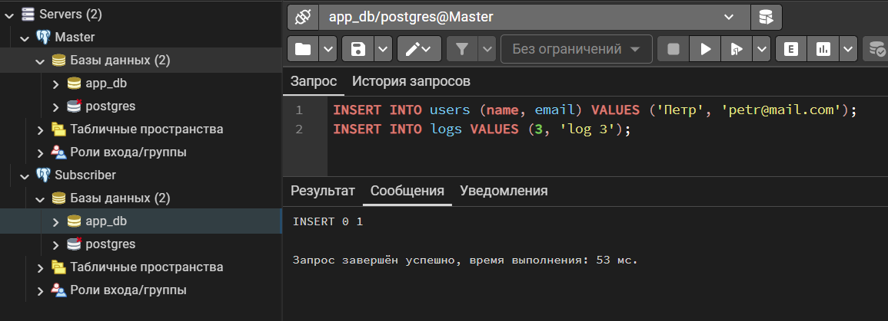
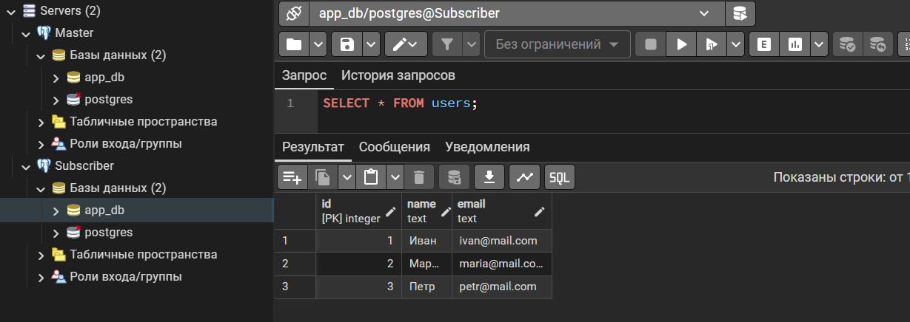

---

Проверка REPLICA IDENTITY
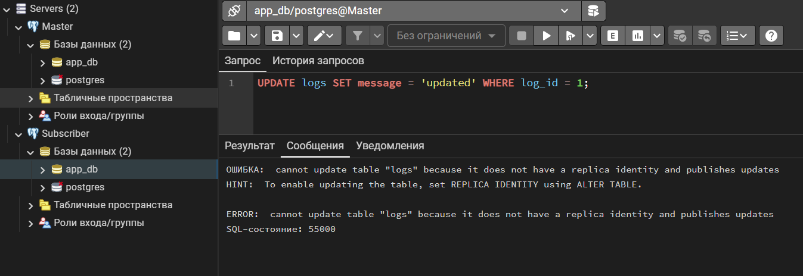
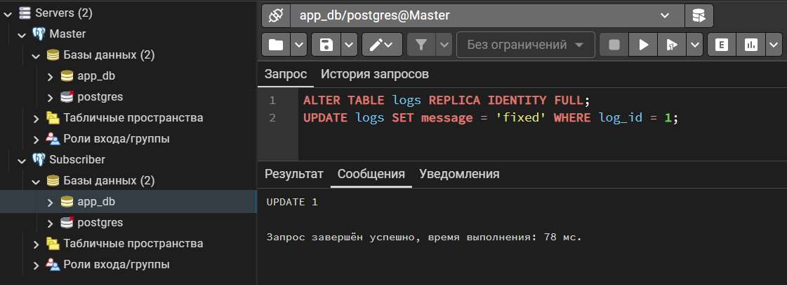
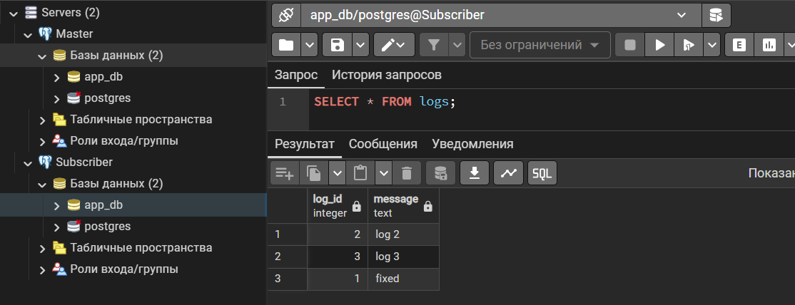

---

Проверка отсутствия DDL
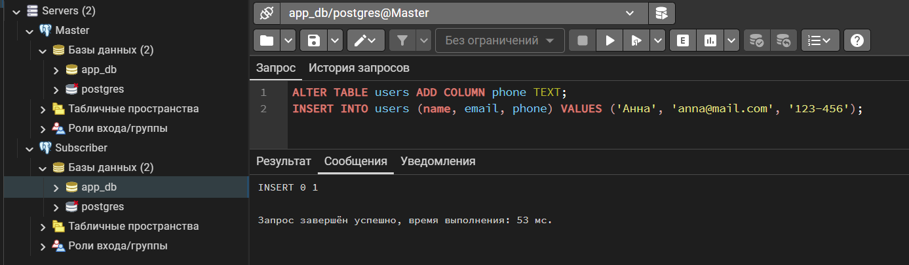
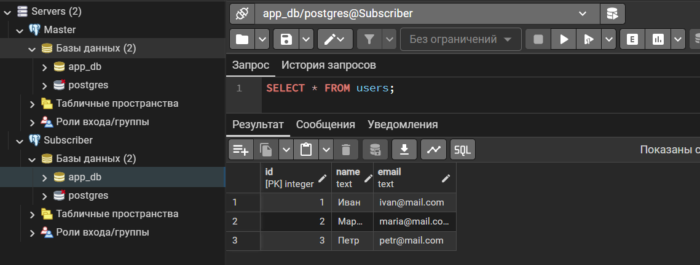

---

Проверка replication status
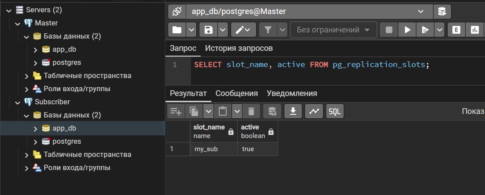
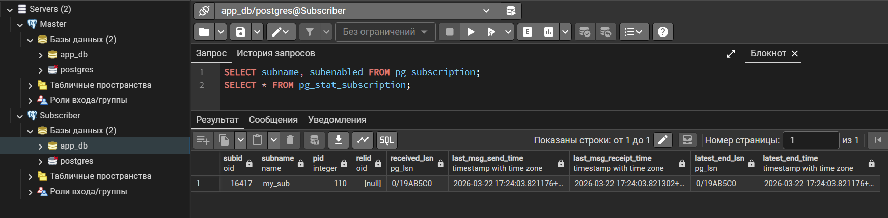

---

pg_dump/pg_restore для:
1)Добавление новой таблицы с существующими данными
2)Когда добавляешь таблицу в публикацию, новые INSERT реплицируются, а старые данные — нет
3)Нужно сделать дамп этой таблицы с мастера и восстановить на подписчике
4)Создание новой реплики с нуля
5)При создании новой подписки можно сразу восстановить дамп всей базы на подписчике, а потом создать подписку — тогда не ждать, пока все данные скопируются через сеть
6)Миграция между разными версиями PostgreSQL
7)Логическая репликация работает между разными версиями, но начальную копию данных нужно делать через pg_dump/pg_restore
8)Восстановление после сбоя
9)Если подписка сломалась или данные на подписчике повреждены, можно быстро восстановить дамп с мастера и пересоздать подписку
